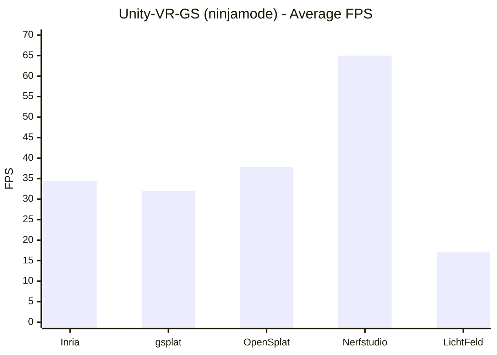
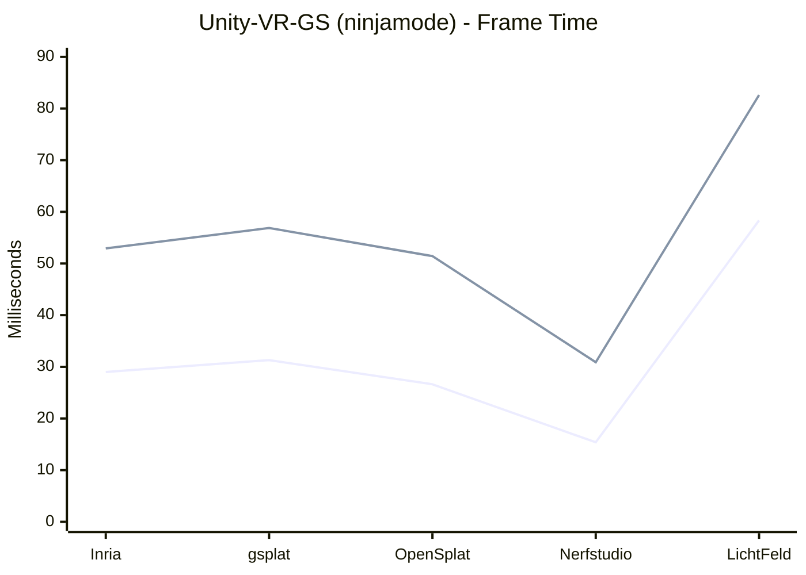

# XR Viewers Comparative Analysis

This document presents a comparative analysis of two XR Gaussian Splatting viewers, evaluated under identical hardware conditions using models trained from a single dataset across five different training pipelines.

---

## Dataset and Reconstructions

**Five different reconstructions** of the same **indoor environment** were used for this analysis.  

They were generated from the same dataset of **151 frames** using the following open-source Gaussian Splatting trainers: Inria gaussian-splatting, gsplat, OpenSplat, Nerfstudio, LichtFeld Studio.

The decision to use an indoor environment for viewer analysis is based on the comparative observations reported in: [analysis/trainers/indoor-vs-outdoor.md](https://github.com/ernesta-sichetti/gaussian-splatting-tools-comparison/blob/main/analysis/trainers/indoor-vs-outdoor.md)

All reconstructions were cleaned prior to evaluation to ensure consistency across viewers.

Detailed information about the reconstructions, the cleaning procedures applied and their impact on the exported `.ply` files  can be found in the following document: [analysis/trainers/indoor.md](https://github.com/ernesta-sichetti/gaussian-splatting-tools-comparison/blob/main/analysis/trainers/indoor.md)

---

## Visual Inspection Protocol

A qualitative visual inspection was conducted to compare the rendering behavior of **Unity-VR-Gaussian-Splatting (ninjamode)** and **GaussianSplattingVRViewerUnity (clarte53)**.

The inspection was conducted on a system running **Windows 11** equipped with a **single NVIDIA RTX 4060 GPU** and a **Meta Quest 3** headset.

All assessments were performed using a 5-point ordinal scale (1–5), where:

- **1** indicates severe and clearly visible artifacts,
- **3** indicates moderate but tolerable instability,
- **5** indicates stable and visually coherent rendering.

The evaluation focused on the following criteria:

- **Surface Solidity** — geometric continuity and absence of holes or fragmentation.
- **Motion Parallax Stability** — depth consistency during head movement.
- **Edge Stability** — absence of flickering or shimmering contours.
- **Layering / Transparency Behavior** — correct depth ordering and occlusion handling.
- **Near-Object Robustness** — rendering stability during close inspection.

---

## Visual Inspection - Unity-VR-Gaussian-Splatting (ninjamode)

<strong>Show / Hide Section</strong>

 

The following section reports the results of the visual inspection conducted on Unity-VR-Gaussian-Splatting (ninjamode).

Detailed setup and execution instructions for Unity-VR-Gaussian-Splatting (ninjamode) can be found in: [How-To](https://github.com/ernesta-sichetti/gaussian-splatting-tools-comparison/blob/main/how-to/viewers/Unity-VR-Gaussian-Splatting(ninjamode).md)

### Inria gaussian-splatting

Surfaces appear solid and structurally coherent across walls, furniture, and floors, with no visible holes or fragmentation. Black spike-like artifacts are observed on the table during head rotation.  When inspecting objects at extremely close range, slight surface compression is observed. 

---

### gsplat

Surfaces remain stable but appear slightly more fluid compared to Inria, and similar spike-like artifacts appear during movement. Close-range inspection reveals visible splats at extreme proximity. 

---

### OpenSplat

Surfaces appear moderately fluid, and colored splats located behind walls become slightly visible during movement. Contours remain generally stable, and near-object inspection behaves slightly better than in Inria and gsplat. 

---

### Nerfstudio

There are visible holes in walls and structural discontinuities, while the floor exhibits transparency artifacts. Splats are more visible on near objects than in the previously evaluated pipelines.

---

### LichtFeld Studio

Some brown splats and other artifacts appear projected onto background walls. Diffuse vibration is visible across the entire scene during movement and rotation. The scene appears to slide or drag during head motion. Contours may vibrate, possibly related to global motion instability. 

---

## Visual Inspection Evaluation - Unity-VR-Gaussian-Splatting (ninjamode)

| Trainer | Surface Solidity | Motion Parallax Stability | Edge Stability | Layering / Transparency | Near-Object Robustness |
|----------|------------------|---------------------------|----------------|------------------------|------------------------|
| Inria gaussian-splatting | 5 | 5 | 4 | 4 | 4 |
| gsplat | 4 | 5 | 4 | 4 | 4 |
| OpenSplat | 4 | 5 | 4 | 3 | 5 |
| Nerfstudio | 2 | 4 | 3 | 2 | 3 |
| LichtFeld Studio | 3 | 2 | 2 | 2 | 3 |

---

## Observations

- **Inria gaussian-splatting** provides the most stable reconstruction in Unity-VR-Gaussian-Splatting (ninjamode), outperforming the other trainers in terms of surface solidity and overall coherence, with only minor spike-like artifacts during rotation.

- **gsplat** performs similarly to Inria but with slightly reduced surface rigidity and occasional spike-like artifacts during movement, positioning it just below Inria in overall structural stability.

- **OpenSplat** maintains stable contours and good near-object robustness comparable to Inria and gsplat, but differs in showing clearer layering instability during motion, with colored splats becoming slightly visible behind walls.

- **Nerfstudio** departs more significantly from the previous trainers, exhibiting visible holes, structural discontinuities, and floor transparency artifacts, resulting in notably reduced geometric solidity and transparency consistency.

- **LichtFeld Studio** presents the strongest motion-related instability among the trainers, with diffuse vibration, dragging during movement and rotation, and brown splats projected onto walls.

---

## Visual Inspection - GaussianSplattingVRViewerUnity (clarte53)

<strong>Show / Hide Section</strong>

 

The following section reports the results of the visual inspection conducted on GaussianSplattingVRViewerUnity (clarte53).

Detailed setup and execution instructions for GaussianSplattingVRViewerUnity (clarte53) can be found in: [How-To](https://github.com/ernesta-sichetti/gaussian-splatting-tools-comparison/blob/main/how-to/viewers/GaussianSplattingVRViewerUnity(clarte53).md)

### Inria gaussian-splatting

Surfaces appear solid and structurally coherent across walls, furniture, and floors. The scene exhibits slowness during head movement and rotation, producing a dragging effect and visual artifacts that seem related to view stability rather than splat noise.  
Contours appear slightly vibratory, and the entire scene gives the impression of vibrating during motion. A sensation of parallax instability is perceived during movement, and a very slight transparency is noticeable in some areas.  

---

### gsplat

Surfaces are generally stable but appear slightly fluid during movement and head rotation. Walls exhibit slight but visible transparency. A sensation of parallax instability is perceived during movement, as observed in Inria.  

---

### OpenSplat

Surfaces appear moderately fluid, and transparency artifacts are visible during movement. The scene exhibits slowness during head motion, as observed in Inria and gsplat, affecting visual coherence. Contours remain generally stable.  

---

### Nerfstudio

Walls appear perforated, with visible holes and structural discontinuities. The floor exhibits transparency artifacts, and splats are clearly visible on near objects. The overall reconstruction appears geometrically degraded, while it provides better motion stability than the previously evaluated trainers.

---

### LichtFeld Studio

The scene runs extremely slowly, although the static visual quality appears high. Brown artifacts are present, while contours appear well defined. The scene drags noticeably during head motion, leading to severe motion instability and usability limitations.

---

## Visual Inspection Evaluation - GaussianSplattingVRViewerUnity (clarte53)

| Trainer | Surface Solidity | Motion Parallax Stability | Edge Stability | Layering / Transparency | Near-Object Robustness |
|----------|------------------|---------------------------|----------------|------------------------|------------------------|
| Inria gaussian-splatting | 5 | 3 | 3 | 4 | 4 |
| gsplat | 4 | 3 | 3 | 3 | 4 |
| OpenSplat | 4 | 3 | 3 | 3 | 4 |
| Nerfstudio | 1 | 4 | 2 | 1 | 3 |
| LichtFeld Studio | 3 | 1 | 4 | 3 | 3 |

---

## Observations

- **Inria gaussian-splatting** presents strong geometric solidity but exhibits motion slowness, dragging effects, slight contour vibration, perceived parallax instability, and minor transparency artifacts during movement.

- **gsplat** presents generally stable surfaces but shows noticeable motion instability and slight wall transparency in some areas, with parallax instability perceived during head movement similarly to Inria.

- **OpenSplat** presents acceptable geometric solidity and generally stable contours, yet displays recurring transparency artifacts and motion-related instability similar to Inria and gsplat.

- **Nerfstudio** exhibits perforated walls, structural discontinuities, and floor transparency artifacts, resulting in strong structural degradation despite relatively better motion stability compared to the other trainers.

- **LichtFeld Studio** provides high static visual quality with well-defined contours but suffers from extreme slowness, dragging during motion, and severe motion instability affecting usability.

---

## Cross-Viewer Comparison

<strong>Show / Hide Section</strong>

 

The following section directly compares the rendering behavior of the two XR viewers.

- **Structural solidity**:
  - Both viewers preserve strong geometric solidity for **Inria gaussian-splatting**, though Unity-VR-Gaussian-Splatting (ninjamode) maintains more stable surfaces with only minor spike-like artifacts, while GaussianSplattingVRViewerUnity (clarte53) introduces motion slowness, dragging, slight contour vibration, and perceived parallax instability.
  - For **gsplat** and **OpenSplat**, geometric solidity remains acceptable in both viewers. In Unity-VR-Gaussian-Splatting (ninjamode), instability is mainly limited to layering artifacts or slight surface fluidity, while in GaussianSplattingVRViewerUnity (clarte53), instability is more closely linked to motion slowness, dragging, transparency, and parallax inconsistency.
  - For **Nerfstudio**, both viewers expose structural weaknesses such as holes and transparency artifacts.
  - For **LichtFeld Studio**, instability appears in both viewers. Unity-VR-Gaussian-Splatting (ninjamode) shows diffuse vibration and depth ordering issues, whereas GaussianSplattingVRViewerUnity (clarte53) is dominated by extreme slowness and dragging.

- **Motion Behavior and Parallax Stability**:
  - **Unity-VR-Gaussian-Splatting (ninjamode)** generally maintains stable motion across trainers, with artifacts mostly localized to specific reconstructions.
  - **GaussianSplattingVRViewerUnity (clarte53)** consistently exhibits motion slowness, dragging, and visual instability. Perceived parallax inconsistency and slight contour vibration recurrently reduce visual coherence during head movement.

- **Visual Artifacts**:
  - In **Unity-VR-Gaussian-Splatting (ninjamode)**, artifacts are primarily related to spike-like splats and layering instability.
  - In **GaussianSplattingVRViewerUnity (clarte53)**, artifacts are more strongly associated with motion instability, dragging, parallax inconsistency, transparency, and overall scene slowness.

- **Usability and Comfort**:
  - **GaussianSplattingVRViewerUnity (clarte53)** proved more difficult to use overall due to visual instability, dragging, and non-stable parallax, resulting in a less comfortable immersive experience, while **Unity-VR-Gaussian-Splatting (ninjamode)** provided a more stable and comfortable overall experience.

---

## Trainer Performance Analysis Protocol - Unity-VR-Gaussian-Splatting (ninjamode)

After completing the comparative evaluation of the two XR viewers, **Unity-VR-Gaussian-Splatting (ninjamode)** was selected for further performance analysis due to its more stable runtime behavior and overall more comfortable immersive experience.  

Quantitative measurements were therefore conducted to evaluate the runtime performance of the different training pipelines when rendered within this viewer.

The values reported in the following table correspond to the average of two acquisition runs. For each scene, measurements were recorded after a 5-second load time, followed by a 30-second performance acquisition window.

---

## Quantitative Results

<strong>Show / Hide Section</strong>

 

| Trainer | Avg FPS | Avg Frame Time (ms) | Avg Max Frame Time (ms) |
|----------|--------:|--------------------:|------------------------:|
| Inria gaussian-splatting | 34.5 | 29.00 | 52.92 |
| gsplat | 32.0 | 31.30 | 56.88 |
| OpenSplat | 37.8 | 26.62 | 51.43 |
| Nerfstudio | 65.0 | 15.39 | 30.89 |
| LichtFeld Studio | 17.2 | 58.35 | 82.62 |

- **Avg FPS** indicates average frames per second measured during the 30 s acquisition window
- **Avg Frame Time (ms)** indicates the mean frame rendering time
- **Avg Max Frame Time (ms)** indicates the mean peak frame time observed during acquisition

---

## Quantitative Visualizations

**Legend**: lighter line = Avg Frame Time (ms), darker line = Avg Max Frame Time (ms)
    
---

## Observations

- **Nerfstudio** achieves the highest average FPS (65.0) and the lowest average frame time (15.39 ms), indicating the strongest real-time performance among the evaluated trainers.

- **LichtFeld Studio** records the lowest average FPS (17.2) and the highest average frame time (58.35 ms), along with the highest maximum frame time (82.62 ms), indicating the weakest runtime performance.

- **OpenSplat** provides the second-highest average FPS (37.8) and the second-lowest frame time (26.62 ms), outperforming Inria and gsplat in rendering speed.

- **Inria gaussian-splatting** and **gsplat** show comparable performance, with Inria achieving slightly higher FPS and lower maximum frame time peaks.

---

## Conclusions

Based on the quantitative results reported in the previous table and the qualitative scores presented in the **Visual Inspection Evaluation — Unity-VR-Gaussian-Splatting (ninjamode)** table, the overall selection falls on **Inria gaussian-splatting** as the most balanced solution in terms of visual stability and runtime performance.

---

## Summary 

- **Unity-VR-Gaussian-Splatting (ninjamode)** provides more stable motion handling and a more comfortable immersive experience, with artifacts generally limited to reconstruction-specific limitations.

- **GaussianSplattingVRViewerUnity (clarte53)** preserves static detail but consistently exhibits motion slowness, dragging effects, and perceived parallax instability, reducing visual coherence and comfort.

- Quantitatively within ninjamode, **Nerfstudio** achieves the highest FPS and lowest frame time.

- **OpenSplat** delivers high rendering speed with balanced frame timing, while **Inria gaussian-splatting** offers a stable compromise between visual solidity and runtime performance.

- **LichtFeld Studio** shows the weakest runtime behavior, with low FPS and high frame time variability.

---
