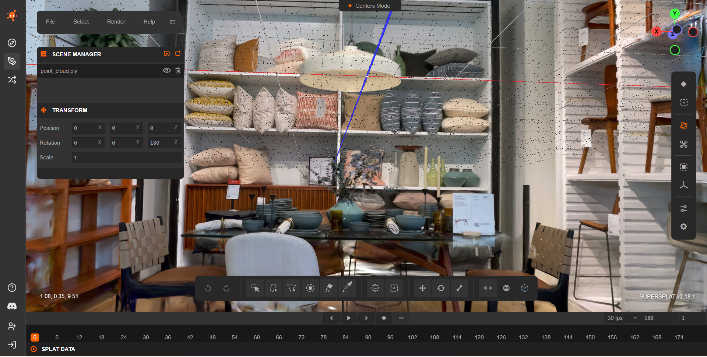
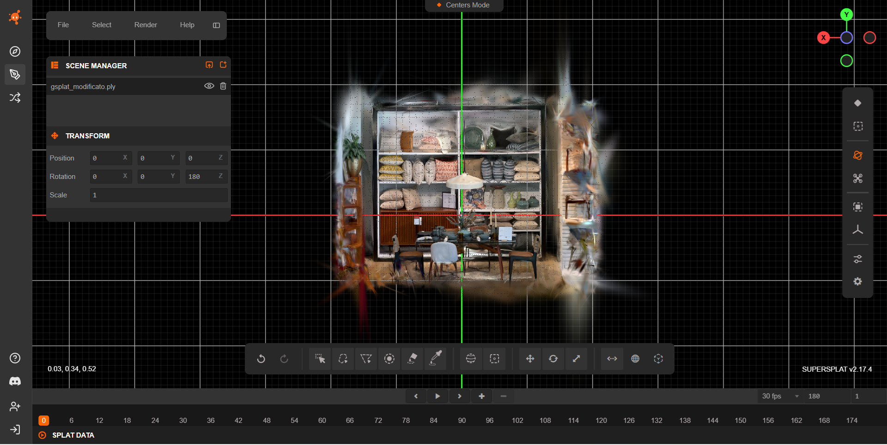
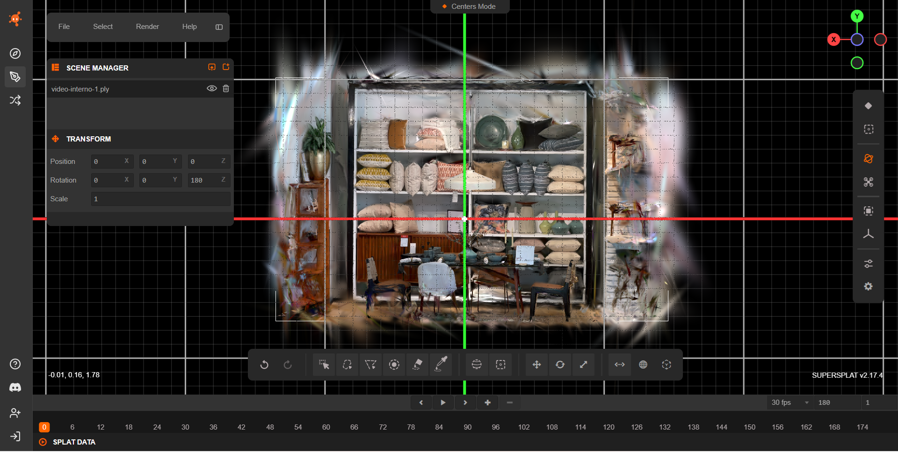
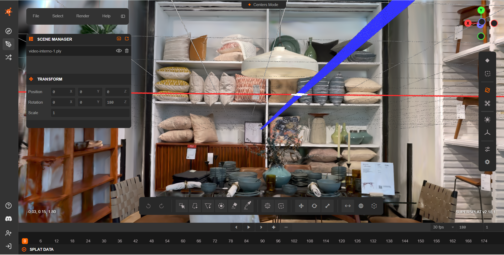
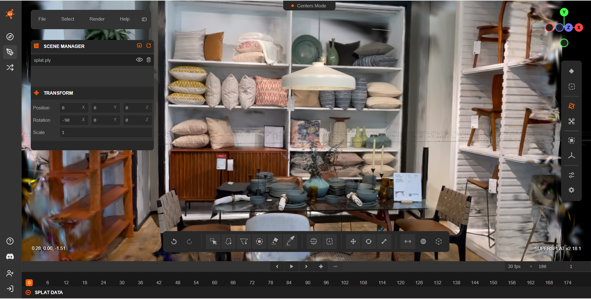
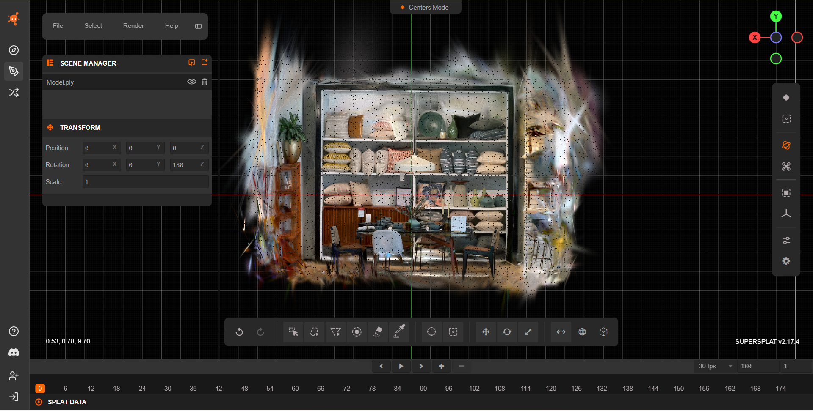

# Indoor Dataset — Benchmark Results

This section reports quantitative benchmarking results for several open-source Gaussian Splatting implementations evaluated on the same indoor dataset.

---

## Dataset Description

The indoor dataset consists of **151 frames** extracted from the following video sequence:

https://huggingface.co/datasets/DL3DV/DL3DV-10K-Sample/tree/main/5c3af581028068a3c402c7cbe16ecf9471ddf2897c34ab634b7b1b6cf81aba00

---

## Experimental Protocol

All implementations were trained under the following conditions:

- **30,000 optimization iterations**
- Same image set (151 frames)
- Training executed on a **single NVIDIA RTX 4060 GPU**
- Default hyper-parameters were used unless explicitly modified for reproducibility
- Exported models were converted to `.ply` format 

For LichtFeld Studio, the **MCMC densification pipeline** was enabled.

---

## Quantitative Results — Indoor Dataset

<strong>Show / Hide Section</strong>

 

| Tool | Output Size (MB) | # Gaussians | MB / 100k | Training Time (min) | Min / 100k | Densification Strategy | Discussion |
|------|----------------:|------------:|----------:|-------------------:|-----------:|----------------------|------------|
| Inria GS | 231 | 867,000 | 26.6 | 150 | 17.3 | Adaptive density control | [How-To](../tools/inria.md) |
| gsplat | 230 | 1,000,000 | 23.0 | 50 | 5.0 | CUDA-optimized default | [How-To](../tools/gsplat.md) |
| OpenSplat | 123 | 510,000 | 24.1 | 60 | 11.7 | Native pruning | [How-To](../tools/opensplat.md) |
| Nerfstudio | 43 | 170,000 | 25.3 | 30 | 17.6 | Adaptive culling + gsplat backend | [How-To](../tools/nerfstudio.md) |
| LichtFeld Studio | 242 | 1,000,000 | 24.2 | 64 | 6.4 | MCMC pipeline | [How-To](../tools/lichtfeld.md) |

## Observations

- **Nerfstudio** produced the most compact representation and shortest training time, at the cost of reduced Gaussian density.

- **OpenSplat** achieved a favorable compromise between output size and visual quality through aggressive pruning.

- **gsplat** and **LichtFeld Studio** generated the densest models, with correspondingly larger output files.

- The original **Inria GS** reference implementation remained the slowest, although it produced structurally stable reconstructions.

---

## Qualitative Evaluation Protocol

Beyond quantitative benchmarking, a qualitative evaluation was conducted on all reconstructed scenes.

Each raw `.ply` output was first inspected visually using **SuperSplat** in order to assess noise distribution, structural coherence, and rendering stability.

Subsequently, a consistent scene-cleaning procedure was applied to all models. The cleaned reconstructions were then re-inspected under the same conditions to enable direct visual comparison between raw and post-processed outputs.

This two-stage inspection protocol supports the qualitative analyses and visual materials presented in the following sections.

## Visual Inspection — Raw Reconstructions (Before Cleaning)

<strong>Show / Hide Section</strong>

 

Before applying any post-processing or pruning, all reconstructed Gaussian Splatting models were visually inspected using **SuperSplat Editor**.

The goal of this inspection phase was:

- to evaluate the **spatial compactness** of the reconstruction,
- to analyze the **distribution of outlier Gaussians**,
- to identify large-scale **floating artifacts**,
- and to qualitatively assess differences between densification strategies
  prior to any cleaning operations.

Each tool was evaluated using its exported `.ply` model under identical visualization conditions.

All figures in this section correspond to screenshots captured in SuperSplat, showing the raw exported .ply models prior to any cleaning or post-processing.

### Inria Gaussian Splatting — Raw Output

The raw reconstruction produced by Inria shows:

- a well-formed central scene volume,
- recognizable geometry of the shelves and furniture,
- peripheral filament-like structures,
- moderate outliers surrounding the main reconstruction.

---

### gsplat — Raw Output

The gsplat reconstruction exhibits:

- a dense core region with good structural detail,
- a wide radial spread of Gaussians,
- long streak-like artifacts extending outward,
- substantial peripheral noise.

---

### OpenSplat — Raw Output

The OpenSplat model shows:

- a clearly defined central structure,
- outliers distributed mainly near the scene boundary,
- fewer extreme-distance splats compared to gsplat,
- moderate peripheral clutter.

---

### Nerfstudio — Raw Output

Nerfstudio’s raw model presents:

- a relatively small and sparse central cluster,
- several isolated Gaussian groups far from the main scene,
- scattered outliers across the viewing volume,
- low overall density.

---
  
### LichtFeld Studio — Raw Output

The LichtFeld Studio output contains:

- a very dense central reconstruction,
- extensive peripheral streaks,
- large spatial spread,
- numerous floating structures.

---

### Summary of Visual Findings (Before Cleaning)

Across all raw reconstructions:

- **Inria** and **OpenSplat** generated comparatively **more compact scene volumes**.
- **gsplat** and **LichtFeld Studio** exhibited the **largest spatial spread** and most pronounced peripheral artifacts.
- **Nerfstudio** produced the sparsest models, but with **isolated distant clusters** affecting global compactness.
- All pipelines benefit significantly from a dedicated cleaning stage prior to deployment in real-time or immersive applications.

---

## Scene Cleaning Procedure (SuperSplat)

<strong>Show / Hide Section</strong>

 

After inspecting the raw reconstructions, all scenes were cleaned using **SuperSplat** in order to reduce outliers and restrict the reconstruction to the indoor region of interest.

The cleaning process was designed to be consistent across all tools and relied on a combination of **spatial filtering** and **attribute-based pruning** to remove spurious Gaussians while preserving the main architectural structure of the scene.

In particular, the following operations were applied:

1. **Spatial restriction of the scene volume**, by isolating the main indoor region and removing distant background splats.
2. **Distance-based pruning**, aimed at deleting Gaussians located far from the main reconstructed volume.
3. **Opacity-based filtering**, removing low-opacity Gaussians that contributed negligibly to rendering but increased clutter and memory usage.
4. **Scale-based filtering** on the Gaussian axes (scale *x*, *y*, *z*), used to eliminate abnormally large primitives often corresponding to sky, floor extrapolations, or reconstruction artifacts.
5. **Surface-area filtering**, targeting oversized Gaussians that spanned large regions of space and typically represented poorly constrained geometry.
6. **Manual inspection and refinement**, performed after automatic filtering to ensure that walls, furniture, and major structural elements were preserved.
7. **Export of the cleaned models** as new `.ply` files for subsequent visual inspection and quantitative comparison.

This cleaning stage was applied uniformly to all reconstructions in order to enable a fair qualitative comparison between raw and post-processed outputs.

---

## Scene Cleaning Evaluation — Indoor Dataset

<strong>Show / Hide Section</strong>

 

This table quantifies the impact of SuperSplat-based cleaning by comparing each raw reconstruction against its cleaned counterpart.

| Tool | Raw Gaussians | Cleaned Gaussians | Δ Gaussians (%) | Raw Size (MB) | Cleaned Size (MB) | Δ Size (%) |
|------|-------------:|------------------:|----------------:|--------------:|------------------:|-----------:|
| Inria GS | 867,000 | 866,617 | −0.04% | 231 | 209.9 | −9.1% |
| gsplat | 1,000,000 | 876,117 | −12.4% | 230 | 201.9 | −12.2% |
| OpenSplat | 510,000 | 273,368 | −46.4% | 123 | 66.2 | −46.2% |
| Nerfstudio | 170,000 | 126,841 | −25.4% | 43 | 30.7 | −28.6% |
| LichtFeld Studio | 1,000,000 | 800,578 | −19.9% | 242 | 193.9 | −19.9% |

## Observations

- **OpenSplat** shows the largest reduction after cleaning (≈ −46 % in both Gaussian count and file size), indicating a substantial amount of spatial outliers and oversized primitives in the raw reconstruction.

- **Nerfstudio** exhibits a consistent decrease in both metrics while maintaining a compact representation, suggesting that its training pipeline already performs partial pruning but still benefits from post-processing.

- **gsplat** and **LichtFeld Studio** undergo reductions of approximately 20 %, reflecting aggressive densification during training and the presence of removable background Gaussians in the raw outputs.

- **Inria GS** remains nearly unchanged after cleaning, which indicates that its reference implementation already produces structurally conservative and stable reconstructions with limited far-field noise.

---

## Visual Inspection — After Cleaning

This section focuses exclusively on the **post-cleaning appearance** of each model, highlighting changes in spatial compactness, peripheral noise removal, and preservation of structural detail.

This section presents both screenshots and screen-recorded orbit videos captured in SuperSplat after the cleaning procedure

### Inria Gaussian Splatting — Cleaned Output

The cleaned Inria reconstruction appears:

- highly compact and centered around the main scene volume,
- with most peripheral floating splats removed,
- shelves, furniture, and table geometry remain stable and well-defined,
- minimal degradation of interior details after filtering.

https://github.com/user-attachments/assets/978274ee-fd2b-4a49-ab45-47e485ae0420

---

### gsplat — Cleaned Output

The cleaned gsplat model shows:

- a noticeably tighter bounding volume,
- strong reduction of radial streak artifacts,
- improved readability of shelves and decorative objects,
- preserved fine details on pillows and tableware.

https://github.com/user-attachments/assets/f2dfa455-ae07-4eae-80f2-072601882549

---

### OpenSplat — Cleaned Output

OpenSplat exhibits one of the most striking improvements after cleaning:

- the scene becomes sharply delimited,
- most exterior ghost structures disappear,
- the main furniture block appears well isolated,
- remaining splats are concentrated almost exclusively inside the true scene envelope.

https://github.com/user-attachments/assets/3b4954fa-b950-46ec-b32b-728b1f27b378

---

### Nerfstudio — Cleaned Output

The cleaned Nerfstudio reconstruction is:

- extremely compact,
- tightly cropped around the shelves and table,
- nearly free of floating splats outside the scene,
- with crisp silhouettes at the borders.

https://github.com/user-attachments/assets/880a85ce-ecfc-4653-ad6b-e24bb658ed49

---

### LichtFeld Studio — Cleaned Output

LichtFeld Studio’s cleaned result shows:

- a significant tightening of the scene volume,
- reduction of external halos,
- preservation of the interior spatial layout,
- dense accumulation of splats inside the furniture cluster.

https://github.com/user-attachments/assets/0363dd17-6705-4a65-b7c4-8bd875d3a325

---

## Summary of Visual Findings (After Cleaning)

After cleaning, the five pipelines exhibit different balances between noise removal, spatial compactness, and reconstruction density:

- **Inria GS** produces a highly contained reconstruction volume, with only minor residual artifacts visible near the extreme lateral boundaries.

- **OpenSplat** yields a compact and sharply delimited scene, although small remnants of peripheral clutter can still be observed at the edges.

- **Nerfstudio** maintains a relatively compact reconstruction while preserving the main structural elements such as chairs, table surfaces, and stacked cushions.

- **gsplat** and **LichtFeld Studio** retain denser interior regions and show thin halos of residual noise near the scene boundaries, indicating a more conservative removal of peripheral Gaussians.

---

