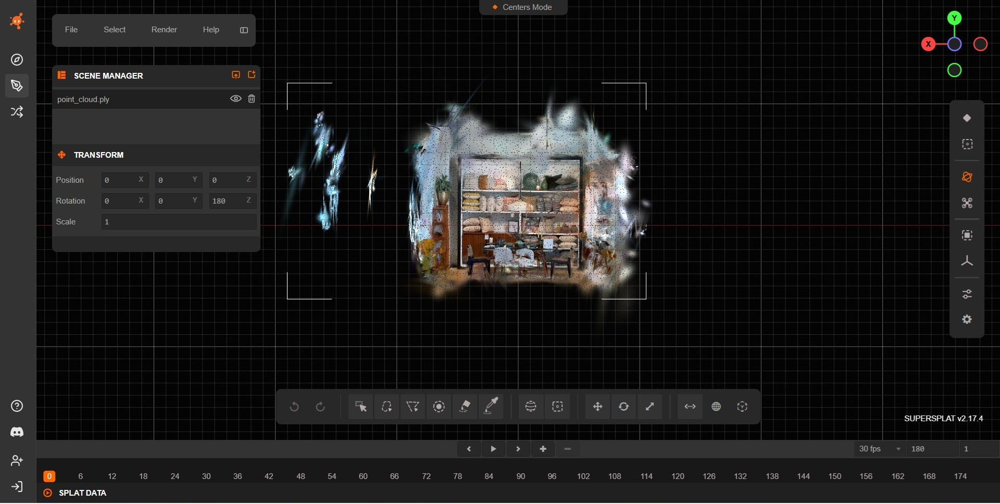

# Indoor Dataset — Benchmark Results and Visual Inspection

This section reports quantitative benchmarking results for five open-source Gaussian Splatting implementations evaluated on the same indoor dataset: Inria, gsplat, OpenSplat, nerfstudio and Lichtfeld Studio.

---

## Dataset Description

The indoor dataset consists of **151 frames** extracted from the following video sequence:

https://huggingface.co/datasets/DL3DV/DL3DV-10K-Sample/tree/main/5c3af581028068a3c402c7cbe16ecf9471ddf2897c34ab634b7b1b6cf81aba00

---

## Experimental Protocol

All implementations were trained under the following conditions:

- **30,000 optimization iterations**
- Same image set (151 frames)
- Training executed on a **single NVIDIA RTX 4060 GPU**
- Default hyper-parameters were used unless explicitly modified for reproducibility
- Exported models were converted to `.ply` format 

For LichtFeld Studio, the **MCMC densification pipeline** was enabled.

---

## Quantitative Results

<strong>Show / Hide Section</strong>

 

| Tool | Output Size (MB) | # Gaussians | MB / 100k | Training Time (min) | Min / 100k | Densification Strategy | Discussion |
|------|----------------:|------------:|----------:|-------------------:|-----------:|----------------------|------------|
| Inria GS | 226.1 | 955,819 | 23.7 | 150 | 15.7 | Adaptive density control | [How-To](../tools/inria.md) |
| gsplat | 225.1 | 1,000,000 | 22.5 | 50 | 5.0 | CUDA-optimized default | [How-To](../tools/gsplat.md) |
| OpenSplat | 120.8 | 510,870 | 23.6 | 60 | 11.8 | Native pruning | [How-To](../tools/opensplat.md) |
| Nerfstudio | 40.2 | 170,150 | 23.6 | 30 | 17.6 | Adaptive culling + gsplat backend | [How-To](../tools/nerfstudio.md) |
| LichtFeld Studio | 236.5 | 1,000,000 | 23.6 | 64 | 6.4 | MCMC pipeline | [How-To](../tools/lichtfeld.md) |

## Observations

- **Nerfstudio** produced the most compact representation in terms of output size and training time, with a relatively low Gaussian count compared to the other pipelines.

- **OpenSplat** achieved a favorable compromise between output size and visual quality.

- **gsplat** and **LichtFeld Studio** generated the densest models.

- The original **Inria GS** reference implementation is the slowest, although it produced a structurally stable reconstruction and a dense model.

---

## Qualitative Evaluation Protocol

Beyond quantitative benchmarking, a qualitative evaluation was conducted on all reconstructed scenes.

Each raw `.ply` output was first inspected visually using **SuperSplat** in order to assess noise distribution and structural coherence.

Subsequently, scene-cleaning was applied to all models. The cleaned reconstructions were then re-inspected using **SuperSplat** to enable direct visual comparison between raw and post-processed outputs.

This two-stage inspection protocol supports the qualitative analyses and visual materials presented in the following sections.

## Visual Inspection — Before Cleaning (Raw Reconstructions)

<strong>Show / Hide Section</strong>

 

Before applying any post-processing, all reconstructed Gaussian Splatting models were visually inspected in the **SuperSplat Editor** using their exported `.ply` files.

The goal of this inspection was:

- to evaluate the **spatial compactness** of the reconstruction,
- to analyze the **distribution of outlier Gaussians**,
- to identify large-scale **floating artifacts**,
- and to qualitatively assess differences between the analyzed tools prior to any cleaning operations.

All figures in this section correspond to screenshots captured in SuperSplat.

### Inria Gaussian Splatting — Raw Output

The raw reconstruction produced by Inria shows a compact central scene volume with clearly recognizable furniture geometry. The overall spatial extent remains limited, with only a small number of peripheral outliers and thin far-field artifacts surrounding the main reconstruction.

---

### gsplat — Raw Output

The gsplat reconstruction exhibits a dense central scene volume with high structural fidelity. However, its overall spatial extent is significantly larger than the one of the Inria recostruction, with numerous peripheral outliers and elongated far-field artifacts radiating outward from the scene core.

---

### OpenSplat — Raw Output

The OpenSplat model presents a well-defined central scene volume with most Gaussians concentrated near the interior region. The overall spatial extent is moderate, with peripheral outliers largely confined to the scene boundaries and fewer far-field artifacts than gsplat, resulting in a comparatively compact reconstruction similar to similar to that observed for Inria.

---

### Nerfstudio — Raw Output

Nerfstudio’s raw output displays a relatively sparse central scene volume and reduced Gaussian density. The overall spatial extent remains moderate compared to that observed for gsplat, although elongated artifacts are present and several isolated peripheral outliers and small far-field clusters are visible beyond the scene core, slightly degrading global compactness.

---
  
### LichtFeld Studio — Raw Output

The LichtFeld Studio reconstruction contains a very dense central scene volume coupled with a large overall spatial extent. Numerous peripheral outliers and far-field artifacts surround the main reconstruction region.

---

### Summary of Visual Findings (Before Cleaning)

Across all raw reconstructions:

- **Inria** and **OpenSplat** generated comparatively **more compact scene volumes**.
- **gsplat** and **LichtFeld Studio** exhibited **large spatial spread** and pronounced peripheral artifacts.
- **Nerfstudio** produced the lightest model, but with **isolated distant clusters** affecting global compactness.
- All pipelines benefit significantly from a dedicated cleaning stage prior to deployment in real-time or immersive applications.

---

## Scene Cleaning Procedure

<strong>Show / Hide Section</strong>

 

After inspecting the raw reconstructions, all scenes were cleaned using **SuperSplat** in order to reduce outliers and restrict the reconstruction to the indoor region of interest.

The cleaning process was designed to be consistent across all tools and relied on a combination of **spatial filtering** and **attribute-based pruning** to remove spurious Gaussians while preserving the main architectural structure of the scene. The reconstructed environment exhibited well-defined spatial boundaries inherent to indoor settings, which made it relatively easy to localize the central scene core and to separate it from peripheral and removable Gaussians.

In particular, the confined nature of the indoor scene allowed for an effective spatial restriction of the region of interest, enabling the removal of a large number of removable Gaussians without compromising walls, furniture, or other structural elements. As a result, filtering operations could be applied in a controlled manner, with their effects being straightforward to visually assess and validate.

In particular, the following operations were applied:

- **Spatial restriction of the scene volume**, by isolating the main indoor region and removing distant background splats outside the room boundaries.
- **Distance-based pruning**, aimed at deleting Gaussians located far from the main reconstructed volume.
- **Opacity-based filtering**, removing low-opacity Gaussians that contributed negligibly to rendering but increased clutter and memory usage.
- **Scale-based filtering** on the Gaussian axes (scale *x*, *y*, *z*), used to eliminate abnormally large primitives often corresponding, floor extrapolations, or reconstruction artifacts.
- **Surface-area filtering**, targeting oversized Gaussians that spanned large regions of space and typically represented poorly constrained geometry.
- **Manual inspection and refinement**, performed to ensure that walls, furniture, and major structural elements were preserved.
7. **Export of the cleaned models** as new `.ply`.

This cleaning stage was applied uniformly to all reconstructions in order to enable a fair qualitative comparison between raw and post-processed outputs.

---

## Scene Cleaning Evaluation

<strong>Show / Hide Section</strong>

 

This table quantifies the impact of SuperSplat-based cleaning by comparing each raw reconstruction against its cleaned counterpart.

| Tool | Raw Gaussians | Cleaned Gaussians | Δ Gaussians (%) | Raw Size (MB) | Cleaned Size (MB) | Δ Size (%) |
|------|-------------:|------------------:|----------------:|--------------:|------------------:|-----------:|
| Inria GS | 867,000 | 866,617 | −0.04% | 231 | 209.9 | −9.1% |
| gsplat | 1,000,000 | 875,884 | −12.4% | 230 | 197.1 | −14.3% |
| OpenSplat | 510,000 | 273,368 | −46.4% | 123 | 66.2 | −46.2% |
| Nerfstudio | 170,000 | 126,841 | −25.4% | 43 | 30.7 | −28.6% |
| LichtFeld Studio | 1,000,000 | 800,515 | −20.0% | 242 | 189.3 | −21.8% |

## Observations

- **OpenSplat** shows the largest reduction after cleaning (≈ −46 % in both Gaussian count and file size).

- **Nerfstudio** exhibits a consistent decrease in both metrics while maintaining a compact representation, suggesting that its training pipeline already performs partial pruning but still benefits from post-processing.

- **gsplat** and **LichtFeld Studio** undergo moderate reductions after cleaning, with gsplat showing a smaller decrease than LichtFeld Studio, reflecting aggressive densification during training and the presence of removable background Gaussians in the raw outputs.

- **Inria GS** remains nearly unchanged after cleaning, which indicates that its reference implementation already produces structurally conservative and stable reconstructions with limited far-field noise.

---

## Visual Inspection — After Cleaning

<strong>Show / Hide Section</strong>

 

This section focuses exclusively on the **post-cleaning appearance** of each model, highlighting changes in spatial compactness, peripheral noise removal, and preservation of structural detail.

This section presents both screenshots and screen-recorded orbit videos captured in SuperSplat after the cleaning procedure

### Inria Gaussian Splatting — Cleaned Output

The cleaned Inria reconstruction displays a highly compact central scene volume tightly aligned with the indoor region of interest. The overall spatial extent is reduced, with most peripheral outliers and far-field artifacts removed.

https://github.com/user-attachments/assets/978274ee-fd2b-4a49-ab45-47e485ae0420

---

### gsplat — Cleaned Output

The cleaned gsplat reconstruction exhibits a strongly compacted central scene volume and a markedly reduced overall spatial extent compared to the raw output. Most peripheral outliers and far-field artifacts have been removed, while dense interior regions and fine structural detail are preserved.

https://github.com/user-attachments/assets/f2dfa455-ae07-4eae-80f2-072601882549

---

### OpenSplat — Cleaned Output

The cleaned OpenSplat reconstruction presents a sharply delimited central scene volume with Gaussians concentrated almost exclusively inside the true interior region. The overall spatial extent is substantially reduced, with only minor peripheral outliers remaining near the scene boundaries.

https://github.com/user-attachments/assets/3b4954fa-b950-46ec-b32b-728b1f27b378

---

### Nerfstudio — Cleaned Output

The cleaned Nerfstudio reconstruction shows an extremely compact central scene volume and a very limited overall spatial extent. Peripheral outliers and far-field clusters are almost entirely eliminated, yielding a tightly cropped reconstruction while preserving the main architectural elements of the scene.

https://github.com/user-attachments/assets/880a85ce-ecfc-4653-ad6b-e24bb658ed49

---

### LichtFeld Studio — Cleaned Output

The cleaned LichtFeld Studio reconstruction now displays a compact central scene volume with a substantially reduced overall spatial extent. Most peripheral outliers and far-field artifacts have been removed, although faint residual halos remain visible near the scene boundaries, reflecting a conservative final pruning stage while maintaining dense interior structure.

https://github.com/user-attachments/assets/0363dd17-6705-4a65-b7c4-8bd875d3a325

---

## Summary of Visual Findings (After Cleaning)

After cleaning, the five pipelines exhibit different balances between noise removal, spatial compactness, and reconstruction density:

- **Inria GS** and **OpenSplat**, which already produced relatively compact raw reconstructions, further reduce their overall spatial extent after cleaning, leaving only minor peripheral remnants near the scene boundaries.

- **gsplat** and **LichtFeld Studio**, previously characterized by large spatial spread and extensive far-field clutter, now exhibit substantially tighter scene volumes, although dense interior regions and thin residual halos persist near the boundaries.

- **Nerfstudio**, which originally displayed sparse reconstructions with isolated distant clusters, presents a tightly cropped scene after cleaning while preserving the main architectural and furniture structures.

---
