# Indoor Dataset — Benchmark Results and Visual Inspection

This section reports quantitative benchmarking results for five open-source Gaussian Splatting implementations evaluated on the same indoor dataset: Inria, gsplat, OpenSplat, nerfstudio and Lichtfeld Studio.

---

## Dataset Description

The indoor dataset consists of **151 frames** extracted from the following video sequence:

https://huggingface.co/datasets/DL3DV/DL3DV-10K-Sample/tree/main/5c3af581028068a3c402c7cbe16ecf9471ddf2897c34ab634b7b1b6cf81aba00

---

## Experimental Protocol

All implementations were trained under the following conditions:

- **30,000 optimization iterations**
- Same image set (151 frames)
- Training executed on a **single NVIDIA RTX 4060 GPU**
- Default hyper-parameters were used unless explicitly modified for reproducibility
- Exported models were converted to `.ply` format 

For LichtFeld Studio, the **MCMC densification pipeline** was enabled.

---

## Quantitative Evaluation Protocol

Quantitative benchmarking was conducted on the raw reconstructions produced by each pipeline prior to any post-processing or cleaning operations.

For each method, the total output file size, the number of reconstructed Gaussians, and the corresponding storage cost normalized per 100k Gaussians are reported. Training time is provided both in absolute minutes and normalized per 100k Gaussians to facilitate cross-method comparison.

All measurements were obtained using the same hardware platform and experimental setup described above.

---

## Quantitative Results

<strong>Show / Hide Section</strong>

 

| Tool | Output Size (MB) | # Gaussians | Storage / 100k Gaussians (MB) | Training Time (min) | Training Time / 100k Gaussians (min) | Densification Strategy | Discussion |
|------|----------------:|------------:|----------:|-------------------:|-----------:|----------------------|------------|
| Inria GS | 226.1 | 955,819 | 23.7 | 120 | 12.6 | Adaptive density control | [How-To](../tools/inria.md) |
| gsplat | 284.8 | 1,265,239 | 22.5 | 50 | 4.0 | CUDA-optimized default | [How-To](../tools/gsplat.md) |
| OpenSplat | 120.8 | 510,870 | 23.6 | 60 | 11.7 | Native pruning | [How-To](../tools/opensplat.md) |
| Nerfstudio | 40.2 | 170,150 | 23.6 | 30 | 17.6 | Adaptive culling + gsplat backend | [How-To](../tools/nerfstudio.md) |
| LichtFeld Studio | 236.5 | 1,000,000 | 23.7 | 60 | 6.0 | MCMC pipeline | [How-To](../tools/lichtfeld.md) |

- **Storage / 100k Gaussians (MB)** measures storage cost normalized by Gaussian count.
- **Training Time / 100k Gaussians (min)** measures training cost normalized by Gaussian count.

### Observations

- **Nerfstudio** produced the most compact representation in terms of output size and training time, with a substantially lower Gaussian count than the other pipelines.

- **OpenSplat** occupies an intermediate position in terms of Gaussian count and storage footprint.

- **gsplat** generated the densest model in terms of Gaussian count and the largest output file, followed by **LichtFeld Studio**.

- The original **Inria GS** reference implementation is the slowest, although it produced a structurally stable reconstruction and a dense model.

---

## Qualitative Evaluation Protocol

Beyond quantitative benchmarking, a qualitative evaluation was conducted on all reconstructed scenes.

Each raw `.ply` output was first inspected visually using **SuperSplat** in order to assess noise distribution and structural coherence.

Subsequently, scene-cleaning was applied to all models. The cleaned reconstructions were then re-inspected using **SuperSplat** to enable direct visual comparison between raw and post-processed outputs.

This two-stage inspection protocol supports the qualitative analyses and visual materials presented in the following sections.

## Visual Inspection — Before Cleaning (Raw Reconstructions)

<strong>Show / Hide Section</strong>

 

Before applying any post-processing, all reconstructed Gaussian Splatting models were visually inspected in the **SuperSplat Editor** using their exported `.ply` files.

The goal of this inspection was:

- to evaluate the **spatial compactness** of the reconstruction,
- to analyze the **distribution of outlier Gaussians**,
- to identify large-scale **floating artifacts**,
- and to qualitatively assess differences between the analyzed tools prior to any cleaning operations.

All figures in this section correspond to screenshots captured in SuperSplat.

### Inria Gaussian Splatting — Raw Output

The raw reconstruction produced by Inria shows a compact central scene volume with clearly recognizable furniture geometry. The overall spatial extent remains limited, with a small detached cluster visible on the left side of the scene and a few thin elongated Gaussians forming far-field artifacts around the core scene structure.

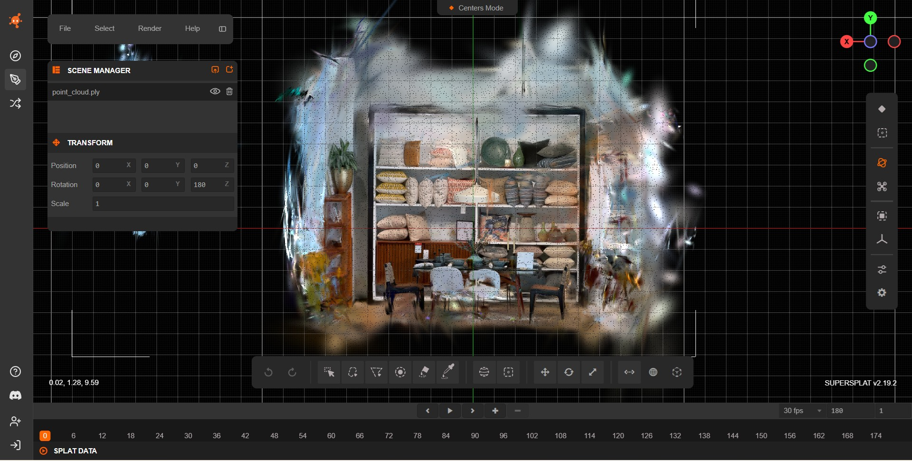

---

### gsplat — Raw Output

The raw gsplat reconstruction presents a clearly defined central core, surrounded by a loose halo of elongated splats and semi-transparent structures, mainly in the upper and lateral regions. These artifacts remain close to the main scene rather than forming large detached clusters.

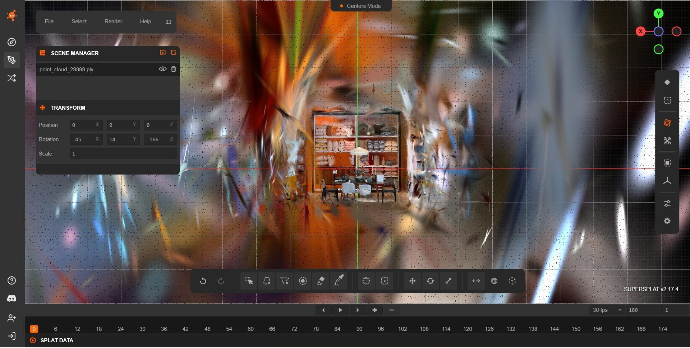
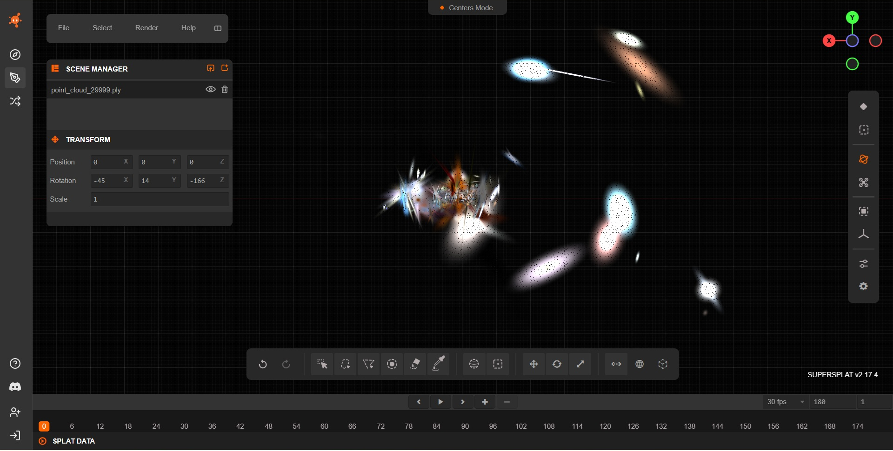

---

### OpenSplat — Raw Output

The raw OpenSplat reconstruction shows a compact central scene core with clearly recognizable geometry, but is surrounded by elongated streak artifacts and detached peripheral clusters that extend the spatial footprint around the main structure. 

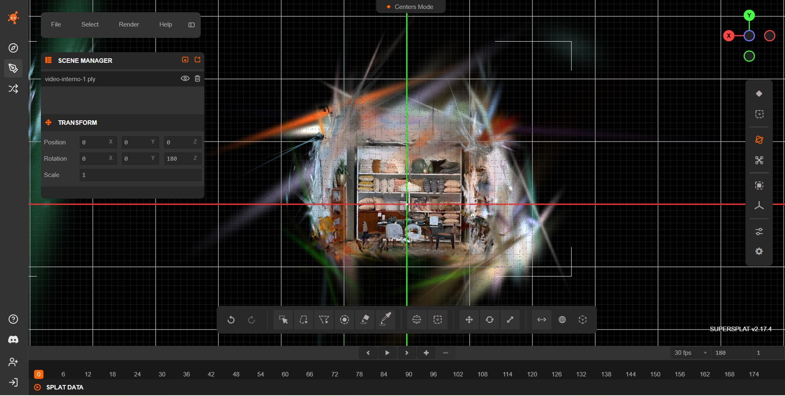

---

### Nerfstudio — Raw Output

The raw Nerfstudio reconstruction exhibits a sparse central scene core surrounded by multiple elongated streak artifacts and isolated peripheral clusters. Thin far-field Gaussians extend well beyond the main interior structure, yielding a fragmented outer envelope and reduced overall compactness.

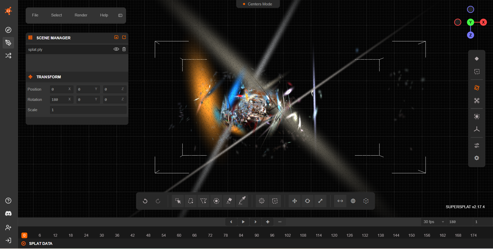

---
  
### LichtFeld Studio — Raw Output

The raw LichtFeld Studio reconstruction shows a very dense central scene core, surrounded by a broad halo of peripheral outliers and far-field streak artifacts, which markedly increase the overall spatial extent of the model.

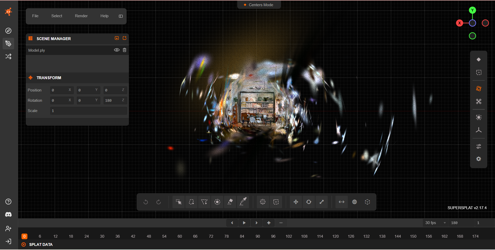
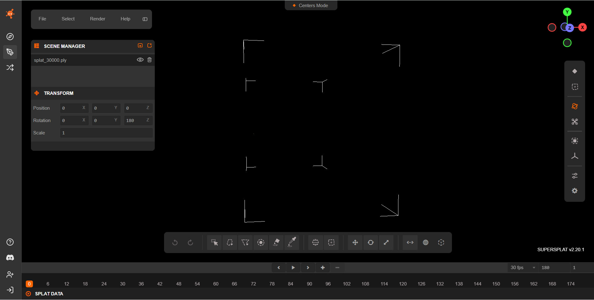

---

### Summary of Visual Findings (Before Cleaning)

Across all raw reconstructions, distinct patterns can be observed in how each pipeline distributes Gaussians around the central scene:

- **Inria** produced one of the most compact raw models, with a clearly defined scene core and only limited peripheral outliers and thin far-field streaks.

- **OpenSplat** retained a relatively concentrated scene core but exhibited larger elongated streak artifacts and scattered peripheral Gaussians around the core.

- **gsplat** generated a dense reconstruction with a visible halo of peripheral Gaussians surrounding the scene core, comparable to Inria and OpenSplat, but without large detached background clusters.

- **LichtFeld Studio** showed the strongest spatial dispersion, combining a very dense scene core with extensive far-field clutter and numerous floating clusters distributed around the core.

- **Nerfstudio** produced the sparsest central reconstruction, but still displayed isolated distant clusters and streak-like artifacts that reduce overall compactness compared to Inria and OpenSplat.

---

## Scene Cleaning Procedure

<strong>Show / Hide Section</strong>

 

After inspecting the raw reconstructions, all scenes were cleaned using **SuperSplat** in order to reduce outliers and restrict the reconstruction to the indoor region of interest.

The cleaning process was designed to be consistent across all tools and relied on a combination of **spatial filtering** and **attribute-based pruning** to remove spurious Gaussians while preserving the main architectural structure of the scene. The reconstructed environment exhibited well-defined spatial boundaries inherent to indoor settings, which made it relatively easy to localize the central scene core and to separate it from peripheral and removable Gaussians.

In particular, the confined nature of the indoor scene allowed for an effective spatial restriction of the region of interest, enabling the removal of a large number of removable Gaussians without compromising walls, furniture, or other structural elements. As a result, filtering operations could be applied in a controlled manner, with their effects being straightforward to visually assess and validate.

In particular, the following operations were applied:

- **Spatial restriction of the scene volume**, by isolating the main indoor region and removing distant background splats outside the room boundaries.
- **Distance-based pruning**, aimed at deleting Gaussians located far from the main reconstructed volume.
- **Opacity-based filtering**, removing low-opacity Gaussians that contributed negligibly to rendering but increased clutter and memory usage.
- **Scale-based filtering** on the Gaussian axes (scale *x*, *y*, *z*), used to eliminate streaks and spike-like artfacts.
- **Surface-area filtering**, targeting oversized Gaussians that spanned large regions of space and typically represented poorly constrained geometry.
- **Manual inspection and refinement**, performed to ensure that walls, furniture, and major structural elements were preserved.
7. **Export of the cleaned models** as new `.ply`.

This cleaning stage was applied uniformly to all reconstructions in order to enable a fair qualitative comparison between raw and post-processed outputs.

---

## Scene Cleaning Evaluation

<strong>Show / Hide Section</strong>

 

This table quantifies the impact of SuperSplat-based cleaning by comparing each raw reconstruction against its cleaned counterpart.

| Tool | Raw Gaussians | Cleaned Gaussians | Δ Gaussians (%) | Raw Size (MB) | Cleaned Size (MB) | Δ Size (%) |
|------|-------------:|------------------:|----------------:|--------------:|------------------:|-----------:|
| Inria GS | 955,819 | 518,140 | −45.8% | 226.1 | 122.6 | −45.8% |
| gsplat | 1,265,239 | 690,776 | −45.4% | 284.8 | 155.5 | −45.4% |
| OpenSplat | 510,870 | 402,531 | −21.2% | 120.8 | 95.2 | −21.2% |
| Nerfstudio | 170,150 | 126,841 | −25.4% | 40.2 | 30.0 | −25.4% |
| LichtFeld Studio | 1,000,000 | 800,515 | −20.0% | 236.5 | 189.3 | −20.0% |

- Δ Gaussians (%) indicates the relative change in the number of Gaussians after cleaning with respect to the raw reconstruction.
- Δ Size (%) reports the relative reduction in file size after cleaning, measured on the exported .ply models.

## Observations

- **gsplat** exhibits the largest absolute reductions both in splat count and file size, while **Inria GS** shows the largest percentage reduction (≈ −45.8%) across both metrics.

- **OpenSplat** sshows a moderate reduction (≈ −21%) in both file size and splat count, indicating more conservative cleaning operations compared to Inria and gsplat.

- **Nerfstudio** exhibits a consistent decrease in both metrics while maintaining the most compact absolute representation in terms of final file size.

- **LichtFeld Studio** undergoes limited but noticeable reductions (≈ −20%) in both metrics, comparable to OpenSplat but starting from a substantially larger raw model.

---

## Visual Inspection — After Cleaning

<strong>Show / Hide Section</strong>

 

This section focuses exclusively on the **post-cleaning appearance** of each model, highlighting changes in spatial compactness, peripheral noise removal, and preservation of structural detail.

This section presents both screenshots and screen-recorded orbit videos captured in SuperSplat after the cleaning procedure

### Inria Gaussian Splatting — Cleaned Output

The cleaned Inria reconstruction preserves the compact central scene volume and clearly recognizable furniture geometry. The previously detached cluster on the left side is no longer visible, and the thin elongated Gaussians forming far-field artifacts around the core are largely removed. The overall spatial extent is further reduced, resulting in a tighter and more spatially focused reconstruction.

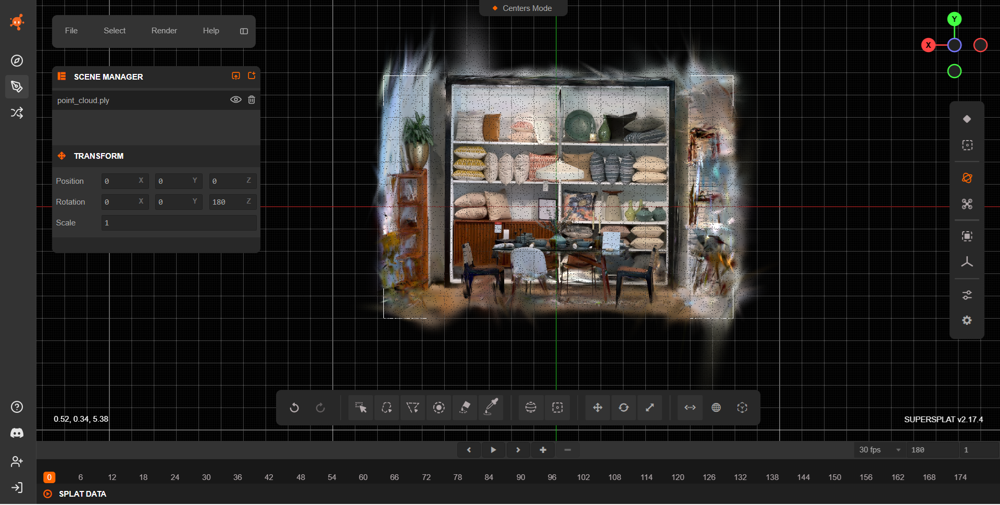

https://github.com/user-attachments/assets/978274ee-fd2b-4a49-ab45-47e485ae0420

---

### gsplat — Cleaned Output

The cleaned gsplat reconstruction shows a markedly more compact central scene volume. Most of the loose halo of elongated splats and semi-transparent structures has been removed, particularly in the upper and lateral regions. The remaining Gaussians are tightly clustered around the main furniture geometry, with only a few faint peripheral streaks persisting near the scene margins and no clearly detached background clusters visible.

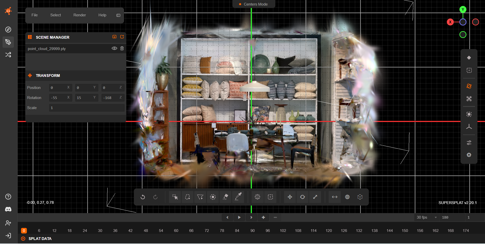
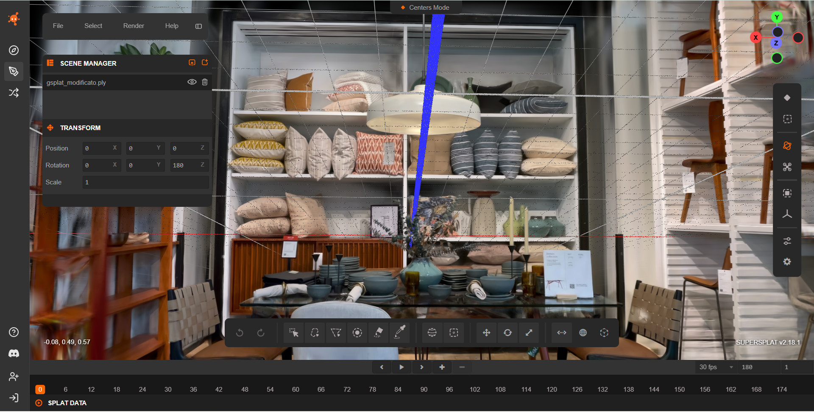

https://github.com/user-attachments/assets/52903544-0081-4fda-bc09-5f5cf14f5438

---

### OpenSplat — Cleaned Output

The cleaned OpenSplat reconstruction shows a sharply delimited central scene core with Gaussians concentrated almost exclusively within the true interior region. The overall spatial extent is strongly reduced, with most elongated streak artifacts and detached peripheral clusters removed, leaving only minor residual outliers near the scene boundaries.

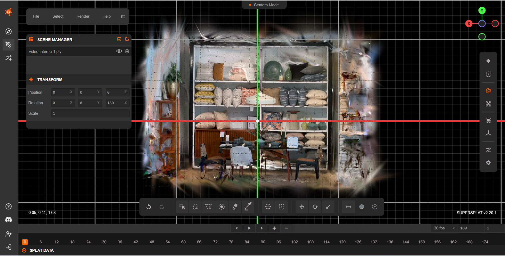

https://github.com/user-attachments/assets/b99ac571-9364-4af1-9bc2-538ebe8a8344

---

### Nerfstudio — Cleaned Output

The cleaned Nerfstudio reconstruction presents a highly compact central scene core with a strongly reduced spatial footprint. Most elongated streak artifacts and detached far-field clusters visible in the raw output are removed, resulting in a tightly cropped volume that preserves the main architectural structures of the interior scene.

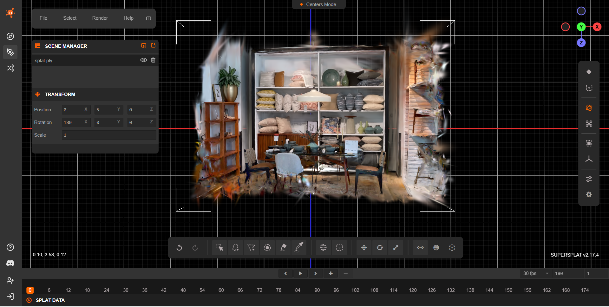

https://github.com/user-attachments/assets/880a85ce-ecfc-4653-ad6b-e24bb658ed49

---

### LichtFeld Studio — Cleaned Output

The cleaned LichtFeld Studio reconstruction presents a compact central scene volume with a strongly reduced spatial footprint. Most peripheral outliers and far-field streak artifacts are removed, although a faint residual halo remains near the scene boundaries, indicating conservative final pruning while preserving dense interior geometry.

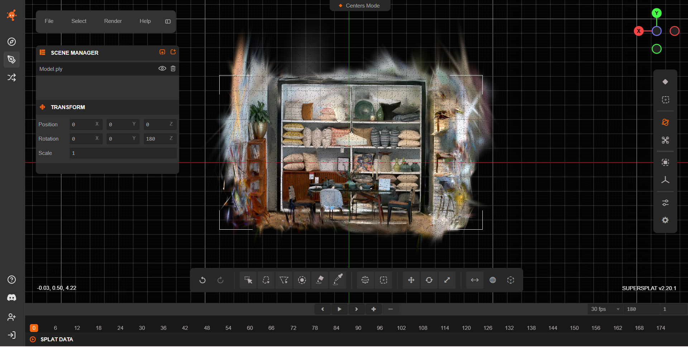
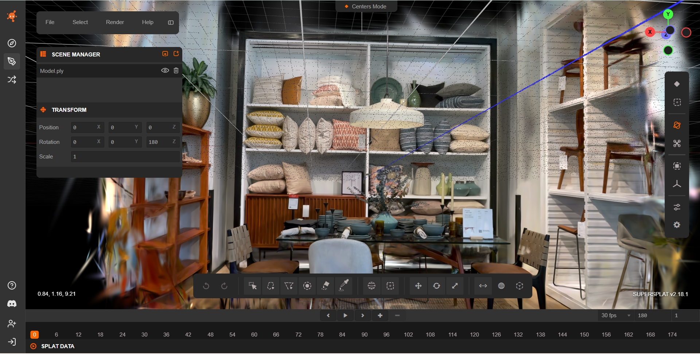

https://github.com/user-attachments/assets/0363dd17-6705-4a65-b7c4-8bd875d3a325

---

## Summary of Visual Findings (After Cleaning)

After cleaning, the five pipelines exhibit different balances between noise removal, spatial compactness, and reconstruction density:

- **Inria GS** and **OpenSplat**, which already produced relatively compact raw reconstructions, further reduce their overall spatial extent after cleaning, leaving only minor peripheral remnants near the scene boundaries.

- **gsplat**, which initially exhibited a moderate halo of peripheral splats, converges to a compact scene volume after cleaning.

- **Nerfstudio**, which originally displayed sparse reconstructions with isolated distant clusters, presents a tightly cropped scene after cleaning while preserving the main architectural and furniture structures

- **LichtFeld Studio**, previously characterized by very large spatial extent and heavy far-field clutter, now shows a substantially tighter reconstruction.
  

---
