# Outdoor Dataset — Benchmark Results and Visual Inspection

This section reports quantitative benchmarking results for several open-source Gaussian Splatting implementations evaluated on the same outdoor dataset: Inria, gsplat, OpenSplat, nerfstudio and Lichtfeld Studio.

---

## Dataset Description

The outdoor dataset consists of **151 frames** extracted from the following video sequence:

https://huggingface.co/datasets/DL3DV/DL3DV-10K-Sample/tree/main/ba55c875d20c34ee85ffc72264c4d77710852e5fb7d9ce4b9c26a8442850e98f

---

## Experimental Protocol

All implementations were trained under the following conditions:

- **30,000 optimization iterations**
- Same image set (151 frames)
- Training executed on a **single NVIDIA RTX 4060 GPU**
- Default hyper-parameters were used unless explicitly modified for reproducibility
- Exported models were converted to `.ply` format 

For LichtFeld Studio, the **MCMC densification pipeline** was enabled.

---

## Quantitative Results

<strong>Show / Hide Section</strong>

 

| Tool | Output Size (MB) | # Gaussians | MB / 100k | Training Time (min) | Min / 100k | Densification Strategy | Discussion |
|------|----------------:|------------:|----------:|-------------------:|-----------:|----------------------|------------|
| Inria GS | 188 | 777,067 | 24.2 | 60 | 7.7 | Adaptive density control | [How-To](../tools/inria.md) |
| gsplat | 238 | 1,031,707 | 23.0 | 45 | 4.4 | CUDA-optimized default | [How-To](../tools/gsplat.md) |
| OpenSplat | 143 | 589,291 | 24.3 | 50 | 8.5 | Native pruning | [How-To](../tools/opensplat.md) |
| Nerfstudio | 48 | 197,545 | 24.3 | 25 | 12.7 | Adaptive culling + gsplat backend | [How-To](../tools/nerfstudio.md) |
| LichtFeld Studio | 242 | 1,000,000 | 24.2 | 50 | 5.0 | MCMC pipeline | [How-To](../tools/lichtfeld.md) |

---

## Observations

- **Nerfstudio** produced the smallest output files and shortest training time

- **OpenSplat** achieved a favorable compromise between reconstruction density and output size through aggressive pruning.

- **gsplat** and **LichtFeld Studio** generated the densest reconstructions, with correspondingly larger output files.

- The original **Inria GS** reference implementation remained slower than the other pipelines, although it produced stable large-scale outdoor reconstructions.

---

## Qualitative Evaluation Protocol

Beyond quantitative benchmarking, a qualitative evaluation was conducted on all reconstructed scenes.

Each raw `.ply` output was first inspected visually using **SuperSplat** in order to assess noise distribution and structural coherence.

Subsequently, scene-cleaning was applied to all models. The cleaned reconstructions were then re-inspected using **SuperSplat** to enable direct visual comparison between raw and post-processed outputs.

This two-stage inspection protocol supports the qualitative analyses and visual materials presented in the following sections.

## Visual Inspection — Before Cleaning (Raw Reconstructions)

<strong>Show / Hide Section</strong>

 

Before applying any post-processing, all reconstructed Gaussian Splatting models were visually inspected in the **SuperSplat Editor** using their exported `.ply` files.

The goal of this inspection was:

- to evaluate the **spatial compactness** of the reconstruction,
- to analyze the **distribution of outlier Gaussians**,
- to identify large-scale **floating artifacts**,
- and to qualitatively assess differences between the analyzed tools prior to any cleaning operations.

All figures in this section correspond to screenshots captured in SuperSplat.

### Inria Gaussian Splatting — Raw Output

The raw reconstruction produced by Inria shows a clearly identifiable central outdoor structure. When visualized to encompass the full extent of the model, Gaussians populate far-field background regions corresponding to distant environmental elements such as vegetation and sorrrounding context. The distribution remains relatively coherent, with streak-like artifacts visible near the central structure and within distant background regions. In addition, some large-scale Gaussians are present in upper regions of the reconstruction, corresponding to portions of the sky.

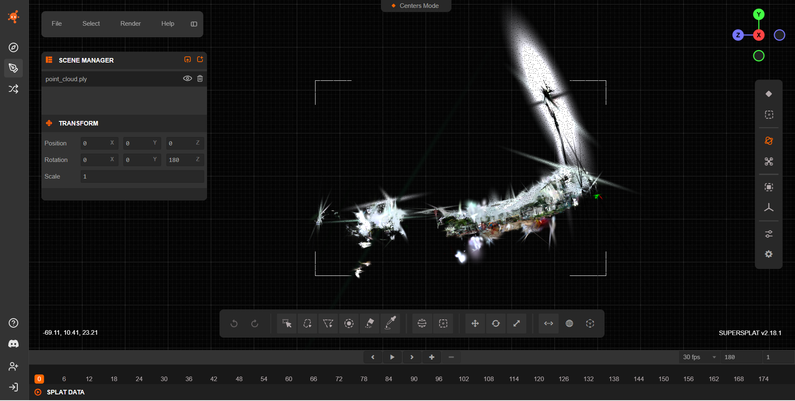
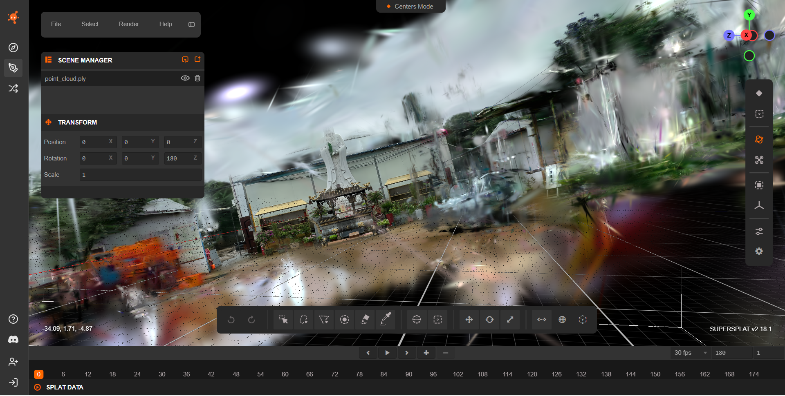

---

### gsplat — Raw Output

The gsplat raw reconstruction shows a clearly identifiable central outdoor structure surrounded by far-field environmental Gaussians that appear less spatially compact than in Inria. When visualized to encompass the full extent of the model, a large number of long vertical streaks and floating clusters are visible near the scene core. In the upper regions, both large-scale Gaussians and thin streaks are present in upper regions of the reconstruction, corresponding to portions of the sky. 

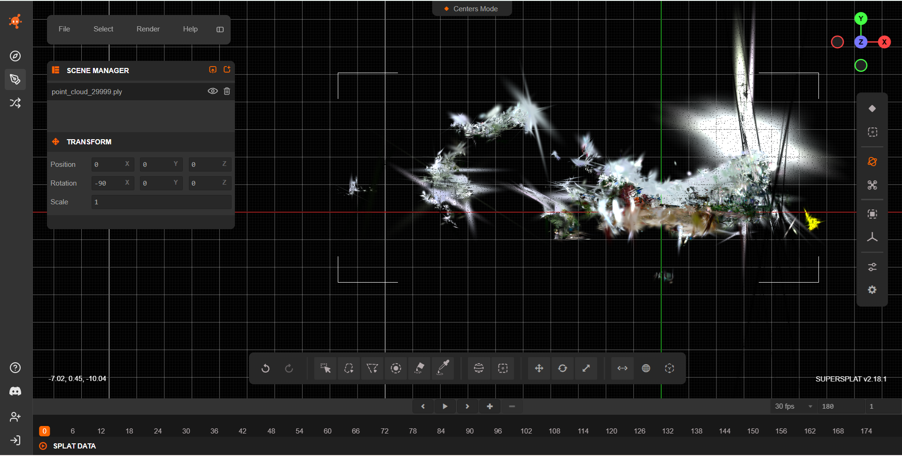
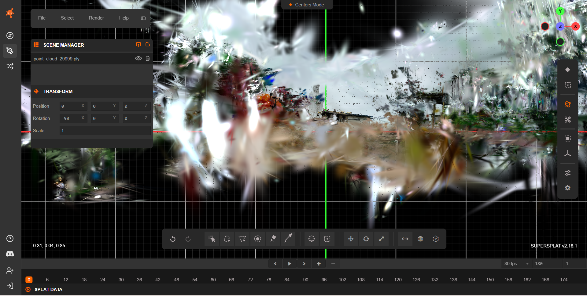

---

### OpenSplat — Raw Output

The OpenSplat raw reconstruction shows a clearly identifiable central outdoor structure surrounded by numerous elongated streaks radiating outward from the scene core. When visualized to include the full extent of the model, prominent spike-like Gaussians extend vertically and diagonally, particularly toward upper regions associated with the sky. Far-field background regions are present but remain less spatially dispersed than in gsplat and Nerfstudio, while isolated floating clusters are comparatively limited. Prominent streaks are visible in upper regions of the reconstruction, corresponding to portions of the sky.

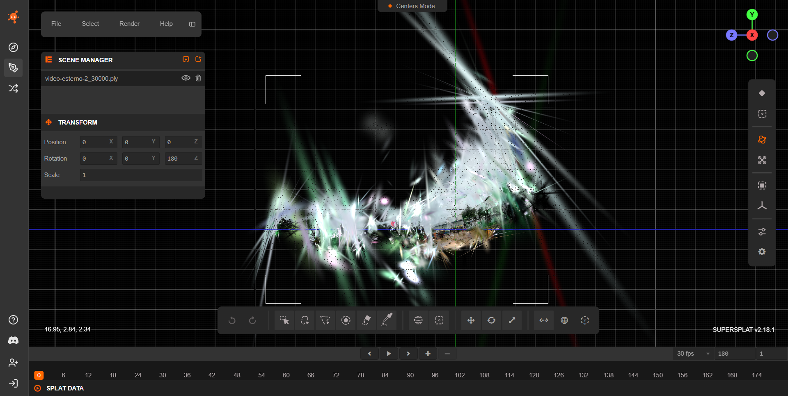
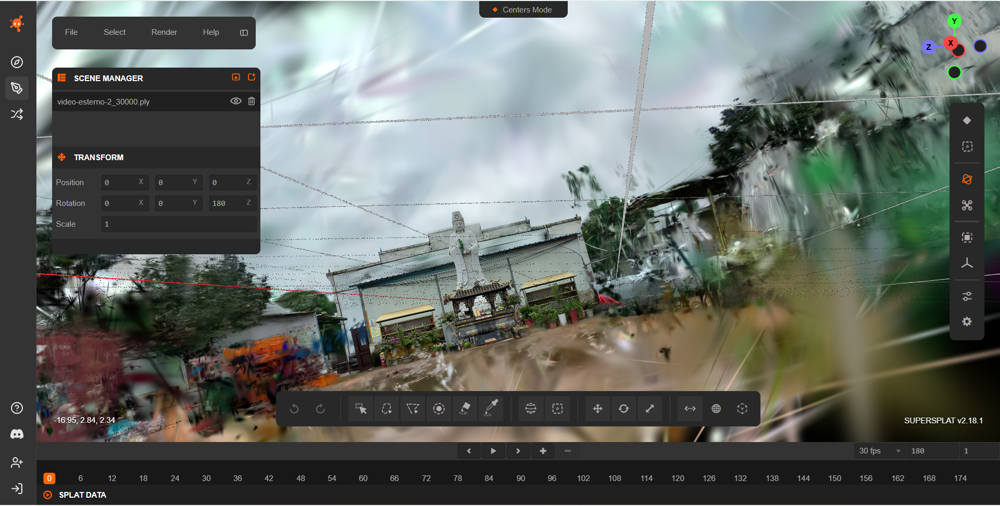

---

### Nerfstudio — Raw Output

The raw Nerfstudio reconstruction exhibits a compact central scene core surrounded by numerous elongated streaks radiating outward in multiple directions. Several thin spike-like structures extend far from the main cluster, together with sparse floating splats dispersed throughout the surrounding volume. Large vertical streaks are also visible above the core, corresponding to sky-related geometry. Overall, the raw output is characterized by a central cluster and a wide halo of elongated peripheral artifacts and detached floating splats.

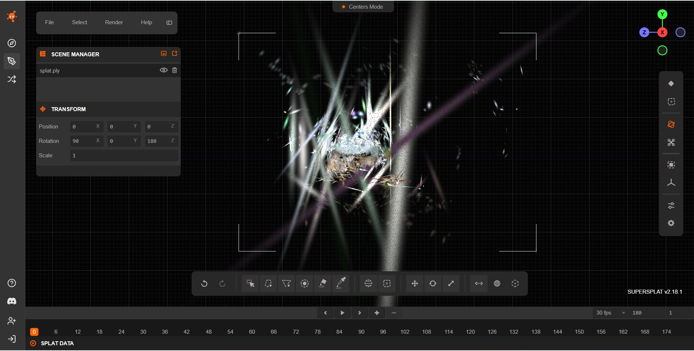
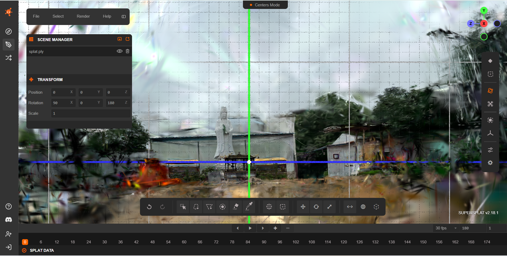

---
  
### LichtFeld Studio — Raw Output

The raw reconstruction produced by LichtFeld Studio shows a dense outdoor scene. When visualized at full scene extent, both structural Gaussians and removable background components remain spatially concentrated around the scene core rather than dispersing into distant clusters. Only a limited number of clearly detached clusters appear at farther distances. Streaks corresponding to portions of the sky are visible in the upper region, together with larger surface Gaussians located further above. Overall, the raw output appears highly concentrated in space but globally extended, with most geometry (both relevant and removable) remaining locally grouped.

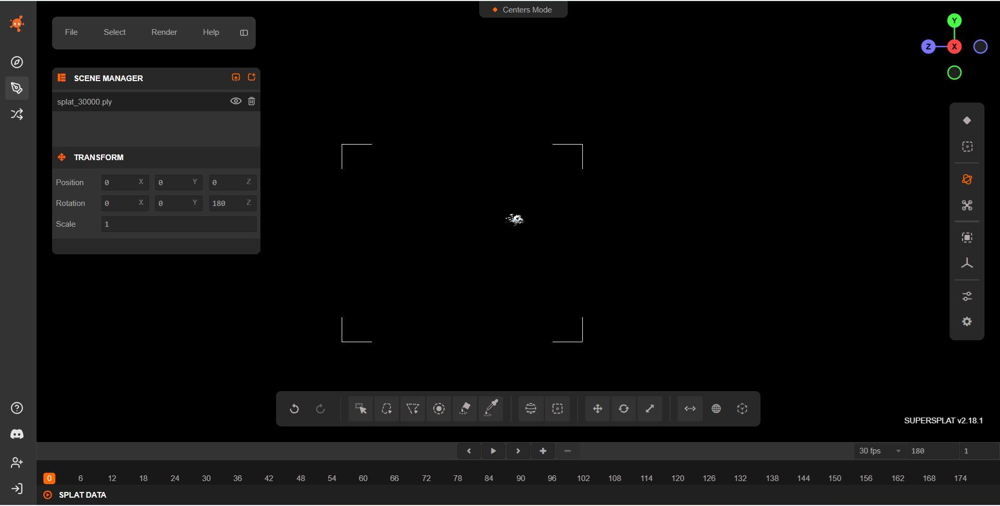
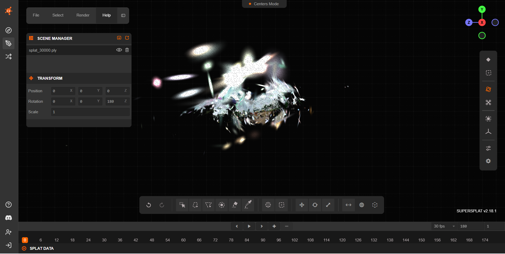
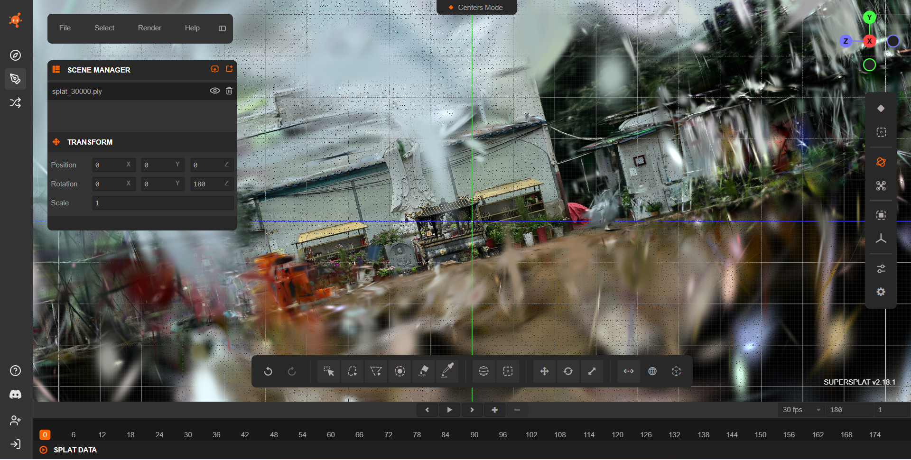

---

### Summary of Visual Findings (Before Cleaning)

Across all raw reconstructions:

- All pipelines reconstruct a clearly identifiable central outdoor structure and include far-field environmental Gaussians corresponding to vegetation or sky regions.
- Across all methods, elongated streaks and large surface Gaussians in upper regions representing the sky are consistently observed.
- **Inria** and **gsplat** exhibit comparatively limited artifact extent relative to the other pipelines, with gsplat slightly more spatially dispersed.
- **OpenSplat** presents numerous elongated streaks around the main structure, particularly in upper sky-related regions, while floating clusters are comparatively limited.
- **Nerfstudio** produces the lightest model but shows many elongated streaks and several isolated floating clusters far from the central structure, resulting in a globally extended reconstruction.
- **LichtFeld Studio** reconstructs an extremely large scene volume while keeping most Gaussians—both structural and removable—spatially concentrated around the scene core.

---

## Scene Cleaning Procedure

<strong>Show / Hide Section</strong>

 

After inspecting the raw reconstructions, all outdoor scenes were cleaned using **SuperSplat** with the goal of reducing removable Gaussians while preserving both the main scene structure and relevant environmental context.

The cleaning process was applied consistently across all five pipelines but proved inherently challenging due to the characteristics of the outdoor reconstructions. In all cases, environmental background elements (such as vegetation, sky regions, and ground reflections) were represented by Gaussians located at significant distances from the central scene core, often forming clusters rather than compact background layers. As a result, a straightforward spatial restriction of the scene volume was not always feasible without risking the removal of valid scene content.

In reconstructions with very large spatial extents, such as **LichtFeld Studio**, and with well defined clusters of spurious Gaussians, such as **Nerfstudio**,  an initial coarse spatial restriction was possible to reduce the recontruction volume or eliminate extreme outliers. However, subsequent refinement stages required careful, localized filtering, as many Gaussians located far from the central structure still corresponded to legitimate background geometry.

Furthermore, several Gaussians that visually appeared removable (such as elongated streaks, thin spike-like structures, or large-scale primitives) were found to contribute to meaningful elements of the scene, including portions of the sky, background vegetation, or ground reflections. This ambiguity made aggressive pruning unsuitable and necessitated a conservative and selective cleaning strategy.

The following operations were therefore applied:

- **Spatial restriction of the scene volume**, performed cautiously to reduce the reconstruction volume or to remove only clearly detached background clusters while preserving distant but valid environmental elements.
- **Distance-based pruning**, applied conservatively to eliminate Gaussians located well beyond the meaningful reconstruction envelope.
- **Opacity-based filtering**, removing low-opacity Gaussians with negligible visual contribution.
- **Scale-based filtering** on the Gaussian axes (scale *x*, *y*, *z*), used to identify and selectively remove abnormally large primitives not associated with stable scene geometry.
- **Surface-area filtering**, targeting oversized Gaussians that spanned large regions of space and did not correspond to coherent environmental elements.
- **Manual inspection and refinement**, required to disambiguate between removable artifacts and Gaussians representing valid background elements.
- **Export of the cleaned models** as new `.ply`.

This cleaning stage was applied uniformly to all reconstructions in order to enable a fair qualitative comparison between raw and post-processed outputs.

---

## Scene Cleaning Evaluation

<strong>Show / Hide Section</strong>

 

This table quantifies the impact of SuperSplat-based cleaning by comparing each raw reconstruction against its cleaned counterpart.

| Tool | Raw Gaussians | Cleaned Gaussians | Δ Gaussians (%) | Raw Size (MB) | Cleaned Size (MB) | Δ Size (%) |
|------|-------------:|------------------:|----------------:|--------------:|------------------:|-----------:|
| Inria GS | 777,067 | 369,432 | −52.5% | 188 | 87.4 | −53.5% |
| gsplat | 1,031,707 | 556,464 | −46.1% | 238 | 125.2 | −47.4% |
| OpenSplat | 589,291 | 463,802 | −21.3% | 143 | 109.7 | −23.3% |
| Nerfstudio | 197,545 | 170,923 | −13.5% | 48 | 40.4 | −15.8% |
| LichtFeld Studio | 1,000,000 | 416,479 | −58.4% | 242 | 98.5 | −59.3% |

## Observations

- **LichtFeld Studio** and **Inria GS** show the largest reductions after cleaning, with both Gaussian counts and file sizes decreasing by more than 50%.

- **gsplat** also undergoes a substantial reduction in both metrics (≈ −46%), indicating a strong impact of post-processing on its dense raw reconstruction.

- **OpenSplat** exhibits more moderate reductions, suggesting that a larger fraction of its raw Gaussians already belonged to the retained scene envelope.

- **Nerfstudio** shows comparatively smaller decreases in both Gaussian count and file size, indicating that its raw reconstruction was already relatively sparse before cleaning.

---

## Visual Inspection — After Cleaning

<strong>Show / Hide Section</strong>

 

This section focuses exclusively on the **post-cleaning appearance** of each model, highlighting changes in spatial compactness, peripheral noise removal, and preservation of structural detail.

This section presents both screenshots and screen-recorded orbit videos captured in SuperSplat after the cleaning procedure

### Inria Gaussian Splatting — Cleaned Output

After cleaning, the Inria reconstruction shows a reduced overall spatial spread, while the main outdoor structure remains clearly defined and visually stable. Really large Gaussians in the upper area are removed. Streaks are partially removed, while some elongated structures persist. The cleaned model appears more spatially focused than the raw version, without noticeable degradation of the core scene geometry.

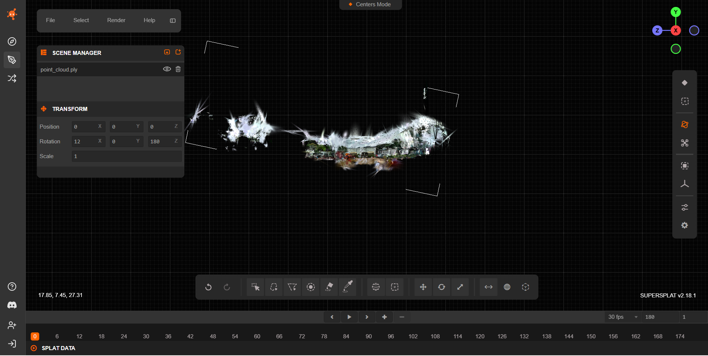
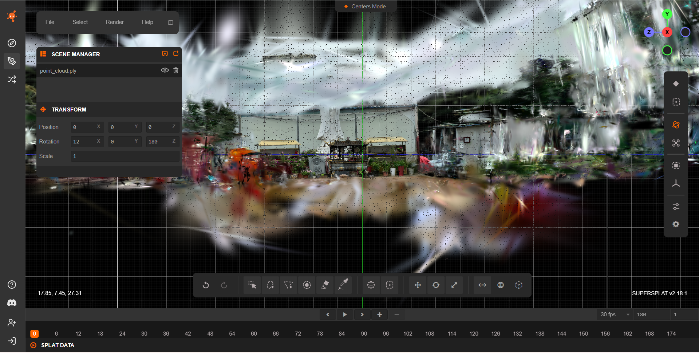
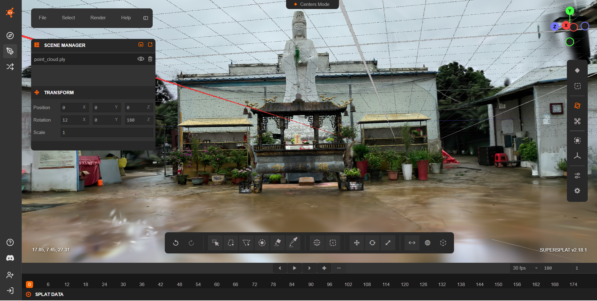

https://github.com/user-attachments/assets/ac54b131-a198-4f4f-83a0-157e8c58ab1c

---

### gsplat — Cleaned Output

After cleaning, detached background clusters appear reduced and elongated streaks apeear mainly removed. The central structure is clearly isolated, while sky-related Gaussians appear more coherent than in the raw output. Overall clutter is substantially reduced, and the scene geometry is more readable and spatially focused.

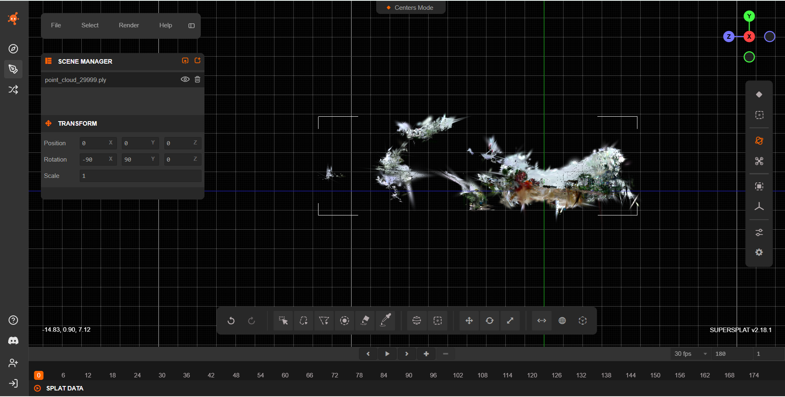
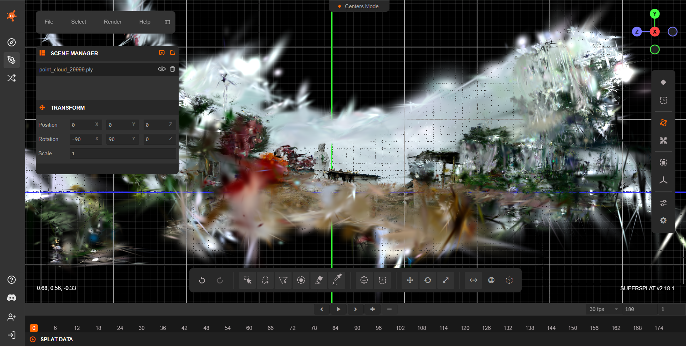
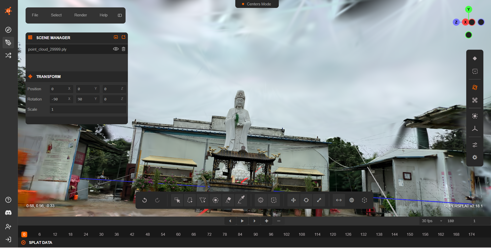

https://github.com/user-attachments/assets/99711339-8d17-40b5-8f44-c4c9c86b66c6

---

### OpenSplat — Cleaned Output

After cleaning, the OpenSplat reconstruction shows a reduced scene envelope, with many peripheral streaks removed. The central structure becomes clearly isolated, while residual sky-related splats are thinner and more localized than in the raw output. Overall, the post-processed model appears easier to inspect, with the main outdoor geometry preserved and artifacts attenuated.

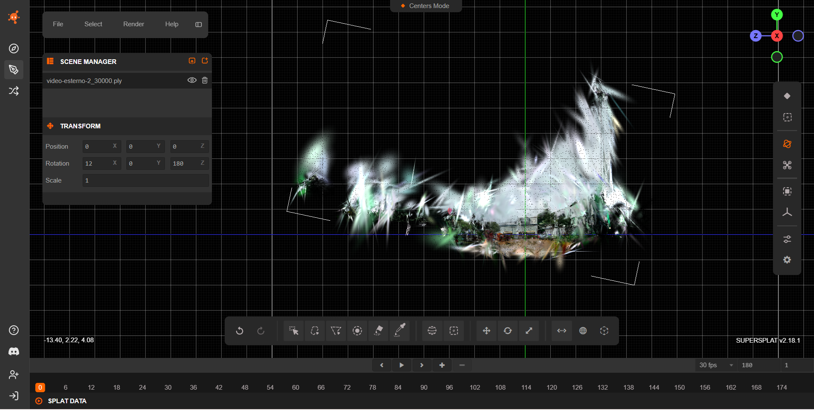
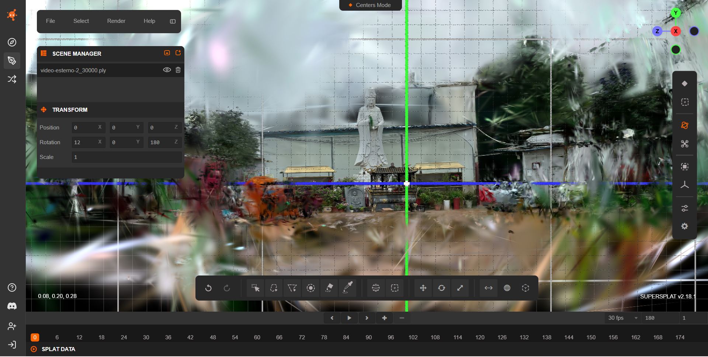
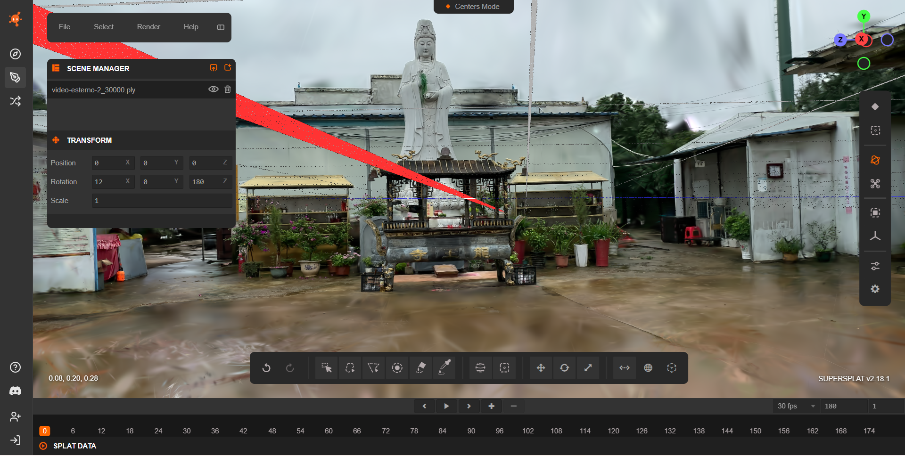

https://github.com/user-attachments/assets/5eee3615-8951-4d4e-a659-99d95364a8b3

---

### Nerfstudio — Cleaned Output

After cleaning, the Nerfstudio reconstruction shows a tightly cropped central scene with most far-field clusters and elongated streak artifacts removed. The main architectural elements remain intact, while background Gaussians associated with the sky and surrounding vegetation are substantially reduced, yielding a visually clearer and more spatially constrained model compared to the raw output.

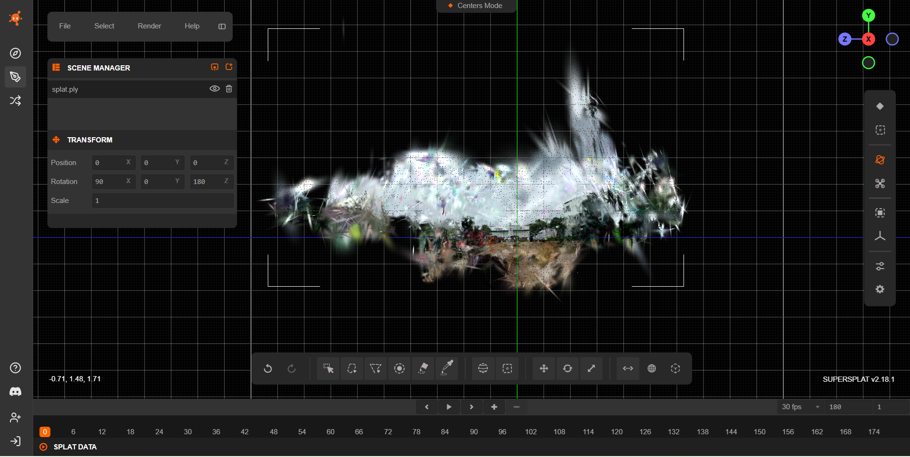
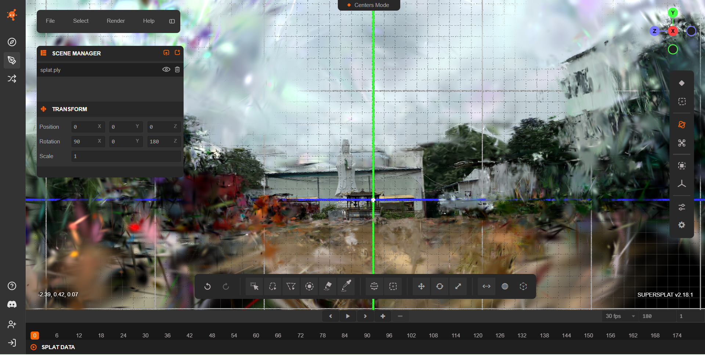
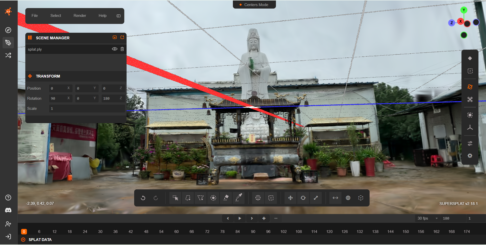

https://github.com/user-attachments/assets/af5c8965-1e4b-4e24-ac9e-8b24d4b03e89

---

### LichtFeld Studio — Cleaned Output

The cleaned LichtField Studio reconstruction shows a strongly centralized and well-bounded scene volume. The large far-field scatter and floating clusters visible in the raw output are largely removed. Architectural elements and vegetation are preserved with improved continuity, while background noise and elongated streak artifacts are substantially reduced. Overall, the result is a compact and visually coherent reconstruction, with only minor peripheral remnants remaining near the outer bounds of the scene.

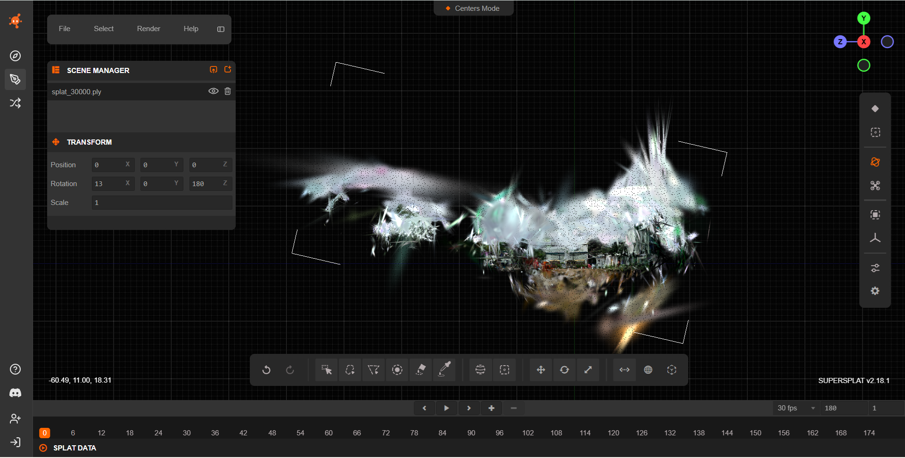
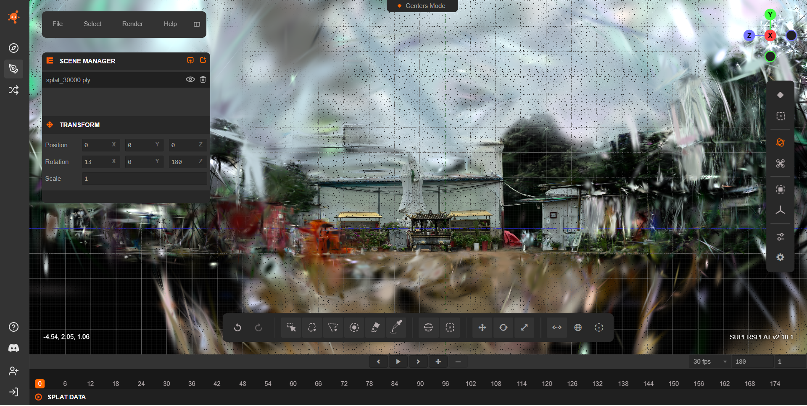
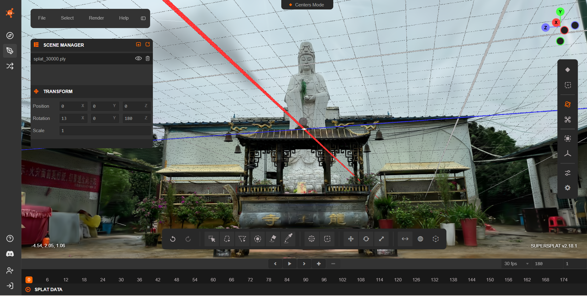

https://github.com/user-attachments/assets/06bb0135-ab14-46e6-a061-9a2e4565e2bc

---

## Summary of Visual Findings (After Cleaning)

After cleaning, all pipelines exhibit a clear reduction in spatial extent and background clutter, while preserving the main outdoor structures.

- **Inria GS** shows reduced overall spread, with very large upper-region Gaussians removed and streaks partially attenuated, while the core scene geometry remains visually stable.

- **gsplat** exhibits reduced detached background clusters and mostly removed streak artifacts, with the central structure more clearly isolated and sky-related Gaussians appearing more coherent.

- **OpenSplat** presents a reduced scene envelope with many peripheral streaks removed, leaving thinner and more localized sky-related splats around a clearly isolated central structure.

- **Nerfstudio** transitions to a tightly cropped reconstruction, with most far-field clusters and elongated streak artifacts removed while preserving the main architectural elements.

- **LichtFeld Studio** shows a strongly centralized and well-bounded scene after cleaning, with far-field scatter and floating clusters largely removed and only minor peripheral remnants remaining.

---

