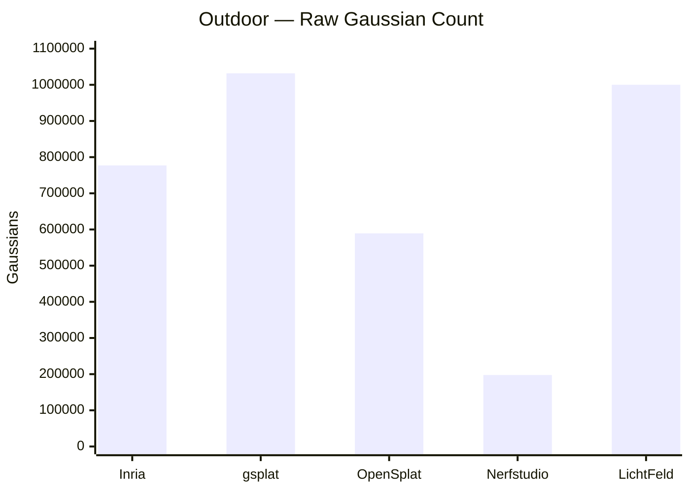
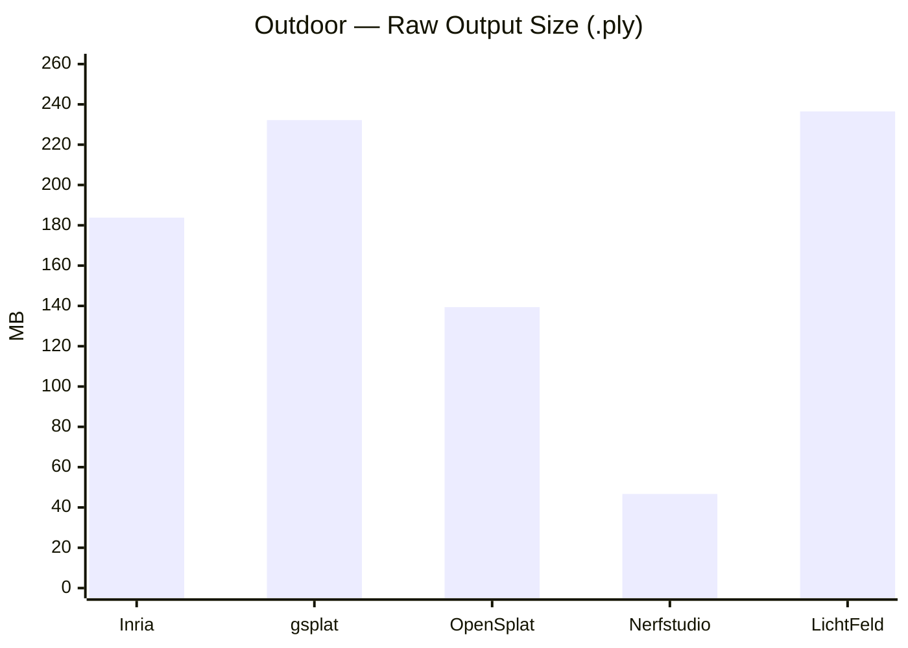
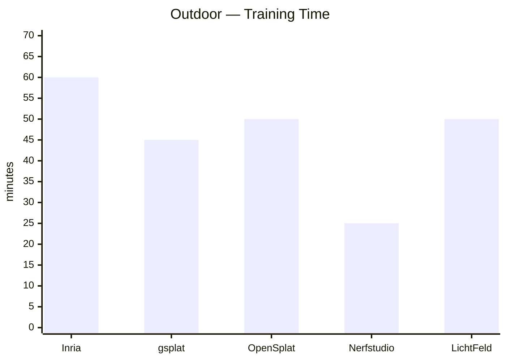
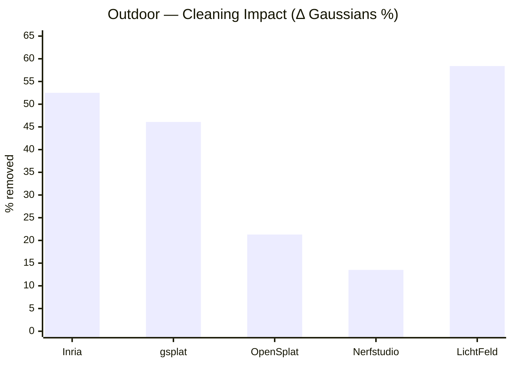

# Outdoor Dataset — Benchmark Results and Visual Inspection

This document reports quantitative benchmarking results for five open-source Gaussian Splatting implementations evaluated on the same outdoor dataset: Inria, gsplat, OpenSplat, Nerfstudio and LichtFeld Studio.

---

## Dataset Description

The outdoor dataset consists of **151 frames** extracted from the following video sequence:

https://huggingface.co/datasets/DL3DV/DL3DV-10K-Sample/tree/main/ba55c875d20c34ee85ffc72264c4d77710852e5fb7d9ce4b9c26a8442850e98f

---

## Experimental Protocol

All implementations were trained under the following conditions:

- **30,000 optimization iterations**
- Same image set (151 frames)
- Training executed on a **single NVIDIA RTX 4060 GPU**
- Default hyperparameters were used unless explicitly modified for reproducibility
- Exported models were converted to `.ply` format 

For LichtFeld Studio, the **MCMC densification pipeline** was enabled.

---

## Quantitative Evaluation Protocol

Quantitative benchmarking was conducted on the raw reconstructions produced by each pipeline prior to any post-processing or cleaning operations.

For each method, the total output file size, the number of reconstructed Gaussians, and the corresponding storage cost normalized per 100k Gaussians are reported. Training time is provided both in absolute minutes and normalized per 100k Gaussians to facilitate cross-method comparison.

All measurements were obtained using the same hardware platform and experimental setup described above.

---

## Quantitative Results

<strong>Show / Hide Section</strong>

 

| Tool | Output Size (MB) | # Gaussians | Storage / 100k Gaussians (MB) | Training Time (min) | Training Time / 100k Gaussians (min) | Densification Strategy | Discussion |
|------|----------------:|------------:|----------:|-------------------:|-----------:|----------------------|------------|
| Inria GS | 183.8 | 777,067 | 23.7 | 60 | 7.7 | Adaptive density control | [How-To](../tools/inria.md) |
| gsplat | 232.2 | 1,031,707 | 22.5 | 45 | 4.4 | CUDA-optimized default | [How-To](../tools/gsplat.md) |
| OpenSplat | 139.4 | 589,291 | 23.7 | 50 | 8.5 | Native pruning | [How-To](../tools/opensplat.md) |
| Nerfstudio | 46.7 | 197,545 | 23.6 | 25 | 12.7 | Adaptive culling + gsplat backend | [How-To](../tools/nerfstudio.md) |
| LichtFeld Studio | 236.5 | 1,000,000 | 23.7 | 50 | 5.0 | MCMC pipeline | [How-To](../tools/lichtfeld.md) |

- **Storage / 100k Gaussians (MB)** measures storage cost normalized by Gaussian count.
- **Training Time / 100k Gaussians (min)** measures training cost normalized by Gaussian count.

## Quantitative Visualizations

---

## Observations

- **Nerfstudio** produces the smallest output file and the shortest training time, with substantially fewer Gaussians than the other pipelines.

- **OpenSplat** occupies an intermediate position in terms of Gaussian count and storage footprint.

- **LichtFeld Studio** produces the largest output file, followed by **gsplat**.

- Although **gsplat** contains more Gaussians than **LichtFeld Studio**, its output file is slightly smaller, indicating that storage cost is influenced not only by Gaussian count but also by the number and numerical precision of per-Gaussian attributes exported by each pipeline.

- The original **Inria GS** reference implementation is slower than the other pipelines, while producing a structurally stable reconstruction.

---

## Qualitative Evaluation Protocol

Beyond quantitative benchmarking, a qualitative evaluation was conducted on all reconstructed scenes.

Each raw `.ply` output was first inspected visually using **SuperSplat** in order to assess noise distribution and structural coherence.

Subsequently, scene-cleaning was applied to all models. The cleaned reconstructions were then re-inspected using **SuperSplat** to enable direct visual comparison between raw and post-processed outputs.

This two-stage inspection protocol supports the qualitative analyses and visual materials presented in the following sections.

## Visual Inspection — Before Cleaning (Raw Reconstructions)

<strong>Show / Hide Section</strong>

 

Before applying any post-processing, all reconstructed Gaussian Splatting models were visually inspected in the **SuperSplat Editor** using their exported `.ply` files.

The goal of this inspection was:

- to evaluate the **spatial compactness** of the reconstruction,
- to analyze the **distribution of outlier Gaussians**,
- to identify large-scale **floating artifacts**,
- and to qualitatively assess differences between the analyzed tools prior to any cleaning operations.

All figures in this section correspond to screenshots captured in SuperSplat.

### Inria Gaussian Splatting — Raw Output

The raw Inria reconstruction shows a clearly identifiable outdoor scene core. Gaussians extend into far-field background regions corresponding to vegetation and surrounding context, forming peripheral structures detached from the core. Elongated streak artifacts are visible near the central area and in distant regions, while large-scale Gaussians appear in the upper portion of the reconstruction, associated with sky regions.

---

### gsplat — Raw Output

The raw gsplat reconstruction shows a clearly identifiable central outdoor structure. Far-field environmental Gaussians extend away from the scene core into surrounding background regions, with environmental elements appearing detached from the main volume. Elongated streak artifacts are visible both close to the scene core and in more distant regions. Streaks and some larger Gaussians associated with the sky are present in the upper portion of the reconstruction.

---

### OpenSplat — Raw Output

The raw OpenSplat reconstruction shows an identifiable outdoor scene core. Numerous elongated streak artifacts radiate outward from the central area, forming a broad and irregular halo around the scene. Prominent spike-like Gaussians extend vertically and diagonally toward upper regions associated with the sky. Additional far-field environmental splats corresponding to vegetation and surrounding context are present beyond the core, while a limited number of isolated floating clusters appear in distant regions.

---

### Nerfstudio — Raw Output

The raw Nerfstudio reconstruction exhibits a compact central scene core surrounded by numerous elongated streaks radiating outward in multiple directions. Several thin spike-like structures extend far from the main structure forming a wide halo, together with sparse floating splats dispersed throughout the surrounding volume. Large vertical streaks are also visible above the core, corresponding to sky-related geometry.

---
  
### LichtFeld Studio — Raw Output

The raw LichtFeld Studio reconstruction shows a very dense outdoor scene core with the main architectural structure clearly identifiable. Both structural Gaussians and removable components remain spatially concentrated around the scene core rather than dispersing into distant clusters. A halo of peripheral Gaussians surrounds the central area. Streaks corresponding to portions of the sky are visible in the upper region, together with larger surface Gaussians located further above.  

---

### Summary of Visual Findings (Before Cleaning)

Across all raw reconstructions, distinct patterns can be observed in how each pipeline distributes Gaussians around the central scene:

- **Inria** reconstructed a well-defined outdoor scene core, but with peripheral environmental structures detached from the main volume.

- **gsplat** produced more environmental elements detached from the main volume than Inria.

- **OpenSplat** preserved a recognizable central structure but exhibites a pronounced irregular halo formed by elongated streaks radiating outward.
  
- **Nerfstudio** generated a compact central cluster surrounded by a wide halo of elongated streaks and thin spike-like structures extending far into the surrounding volume, together with sparse detached splats.

- **LichtFeld Studio** reconstructed a very dense central region encircled by a halo of peripheral Gaussians, with most removable and structural components remaining locally grouped around the core. It presents the largest spatial footprint among the tested pipelines.

---

## Scene Cleaning Procedure

<strong>Show / Hide Section</strong>

 

After inspecting the raw reconstructions, all outdoor scenes were cleaned using **SuperSplat** with the goal of reducing removable Gaussians while preserving both the main scene structure and relevant environmental context.

The cleaning process was applied consistently across all five pipelines but proved inherently challenging due to the characteristics of the outdoor reconstructions. In all cases, Gaussians representing environmental background elements (such as vegetation, sky regions, and ground reflections) were detached from the central scene core. As a result, a straightforward spatial restriction of the scene volume was not always feasible without risking the removal of valid scene content.

In reconstructions with very large spatial extents, such as **LichtFeld Studio**, and with well defined clusters of spurious Gaussians, such as **Nerfstudio**,  an initial coarse spatial restriction was possible to reduce the reconstruction volume or eliminate extreme outliers. However, subsequent refinement stages required careful, localized filtering, as many Gaussians located far from the central structure still corresponded to legitimate background geometry.

Furthermore, several Gaussians that visually appeared removable (such as elongated streaks, thin spike-like structures, or large-scale primitives) were found to contribute to meaningful elements of the scene, including portions of the sky, background vegetation, or ground reflections. This ambiguity made aggressive pruning unsuitable and necessitated a conservative and selective cleaning strategy.

The following operations were therefore applied:

- **Spatial restriction of the scene volume**, performed cautiously to reduce the reconstruction volume or to remove only clearly detached spurious clusters while preserving distant but valid environmental elements.
- **Distance-based pruning**, applied conservatively to eliminate Gaussians located well beyond the meaningful reconstruction envelope.
- **Opacity-based filtering**, removing low-opacity Gaussians with negligible visual contribution.
- **Scale-based filtering** on the Gaussian axes (scale *x*, *y*, *z*), used to identify and selectively remove streaks and spike-like structures not associated with stable scene geometry.
- **Surface-area filtering**, targeting oversized Gaussians that spanned large regions of space and did not correspond to coherent environmental elements.
- **Manual inspection and refinement**, required to disambiguate between removable artifacts and Gaussians representing valid background elements.
- **Export of the cleaned models** as new `.ply`.

This cleaning stage was applied uniformly to all reconstructions in order to enable a fair qualitative comparison between raw and post-processed outputs.

---

## Scene Cleaning Evaluation

<strong>Show / Hide Section</strong>

 

This table quantifies the impact of SuperSplat-based cleaning by comparing each raw reconstruction against its cleaned counterpart.

| Tool | Raw Gaussians | Cleaned Gaussians | Δ Gaussians (%) | Raw Size (MB) | Cleaned Size (MB) | Δ Size (%) |
|------|-------------:|------------------:|----------------:|--------------:|------------------:|-----------:|
| Inria GS | 777,067 | 369,432 | −52.5% | 183.8 | 87.4 | −52.4% |
| gsplat | 1,031,707 | 556,464 | −46.1% | 232.2 | 125.2 | −46.1% |
| OpenSplat | 589,291 | 463,802 | −21.3% | 139.4 | 109.7 | −21.3% |
| Nerfstudio | 197,545 | 170,923 | −13.5% | 46.7 | 40.4 | −13.5% |
| LichtFeld Studio | 1,000,000 | 416,479 | −58.4% | 236.5 | 98.5 | −58.3% |

- Δ Gaussians (%) indicates the relative change in the number of Gaussians after cleaning with respect to the raw reconstruction.
- Δ Size (%) reports the relative reduction in file size after cleaning, measured on the exported .ply models.

## Quantitative Visualizations

## Observations

- **LichtFeld Studio** and **Inria GS** exhibit the largest impact from SuperSplat-based cleaning, with reductions exceeding 50% in both Gaussian count and file size.

- **gsplat** also undergoes a substantial reduction in both metrics (≈ −46%), indicating a strong impact of post-processing on its dense raw reconstruction.

- **OpenSplat** shows more moderate decreases, suggesting that a larger fraction of its raw Gaussians already lay within the preserved scene envelope.

- **Nerfstudio** experiences comparatively smaller reductions in both metrics, indicating that its raw reconstruction was already relatively sparse prior to cleaning.
  

---

## Visual Inspection — After Cleaning

<strong>Show / Hide Section</strong>

 

This section focuses exclusively on the **post-cleaning appearance** of each model, highlighting changes in spatial compactness, peripheral noise removal, and preservation of structural detail.

This section presents both screenshots and screen-recorded orbit videos captured in SuperSplat after the cleaning procedure.

### Inria Gaussian Splatting — Cleaned Output

The cleaned Inria reconstruction exhibits a noticeably reduced spatial extent while preserving a clearly identifiable and stable outdoor scene core. Most large-scale Gaussians in the upper regions associated with the sky are removed. Elongated streak artifacts are partially suppressed, although some thin residual structures persist around the scene envelope. The cleaned model appears significantly more spatially focused than the raw version, without visible degradation of the main architectural geometry.

https://github.com/user-attachments/assets/ac54b131-a198-4f4f-83a0-157e8c58ab1c

---

### gsplat — Cleaned Output

The cleaned gsplat reconstruction shows a reduction of detached background splats and far-field clutter. Several elongated streak artifacts visible in the raw output are attenuated, while others persist near the scene core and in sky-related regions. The central outdoor structure appears more clearly separated from surrounding artifacts, and the scene geometry is more spatially focused than in the raw reconstruction.

https://github.com/user-attachments/assets/99711339-8d17-40b5-8f44-c4c9c86b66c6

---

### OpenSplat — Cleaned Output

The cleaned OpenSplat reconstruction shows a reduced spatial footprint, with many of the peripheral streak artifacts removed. The central outdoor structure is more clearly isolated, while residual sky-related splats appear thinner and more localized than in the raw output. Some elongated structures persist near the upper regions, but the scene envelope is narrower and the main geometry remains well preserved.

https://github.com/user-attachments/assets/5eee3615-8951-4d4e-a659-99d95364a8b3

---

### Nerfstudio — Cleaned Output

The cleaned Nerfstudio reconstruction shows a tightly cropped central scene, with most far-field clusters and elongated streak artifacts removed. The main architectural elements remain intact, while background Gaussians associated with the sky and surrounding vegetation are substantially reduced, yielding a visually clearer and more spatially constrained model than the raw output.

https://github.com/user-attachments/assets/af5c8965-1e4b-4e24-ac9e-8b24d4b03e89

---

### LichtFeld Studio — Cleaned Output

The cleaned LichtFeld Studio reconstruction shows a more centralized and better bounded scene volume than the raw version. Part of the far-field scatter and several floating clusters are removed, while the main architectural structure and vegetation remain clearly identifiable. Background streak artifacts are reduced, although thin residual halos and sparse peripheral splats persist near the scene boundaries. The cleaned model appears more spatially constrained while preserving the dense core of the reconstruction.

https://github.com/user-attachments/assets/06bb0135-ab14-46e6-a061-9a2e4565e2bc

---

## Summary of Visual Findings (After Cleaning)

After cleaning, the five pipelines show different degrees of spatial compaction and artifact suppression while preserving the main outdoor structures:

- **Inria GS**, which already produced a relatively controlled raw reconstruction, further reduces its spatial footprint after cleaning.

- **gsplat**, which initially exhibited detached background splats and streak artifacts around the core, shows a clearer separation between the central structure and surrounding clutter after cleaning.

- **OpenSplat** presents a reduced scene envelope with many peripheral streaks removed, leaving thinner and more localized sky-related splats around a clearer isolated central structure.

- **Nerfstudio**, which originally displayed extensive halos and far-field clusters, transitions to a tightly cropped reconstruction after cleaning.

- **LichtFeld Studio**, previously characterized by a dense core surrounded by wide peripheral halos, shows a more centralized and bounded scene volume after cleaning.

---

## Summary

- The outdoor scene produces **raw reconstructions with wide spatial footprints**, characterized by far-field Gaussians associated with sky, vegetation, and surrounding environmental context.

- **Scene cleaning is inherently challenging**, as many Gaussians located far from the central structure correspond to valid background elements and cannot be safely removed through aggressive spatial pruning.

- Quantitatively, **LichtFeld Studio** and **Inria GS** undergo the largest relative reductions after cleaning (≈ −58% and ≈ −52%, respectively), indicating the presence of substantial removable peripheral structure in their raw outputs.

- **gsplat** also experiences strong pruning (≈ −46%), reflecting its dense raw reconstruction.

- **OpenSplat** shows more moderate reductions (≈ −21%), suggesting a more balanced distribution between central structure and retained environmental geometry.

- **Nerfstudio** exhibits the smallest relative reduction (≈ −13%), indicating that a large fraction of its raw Gaussians already contributes to the preserved outdoor scene content.

- After post-processing, all pipelines retain **thin residual halos and sky-related splats persisting around the central structure**, reflecting the intrinsic complexity of outdoor environments.

- Overall, the outdoor benchmark highlights **strong inter-method variability in background modeling and pruning effectiveness**, emphasizing the importance of environment-aware post-processing strategies when dealing with unconstrained scenes.

---
